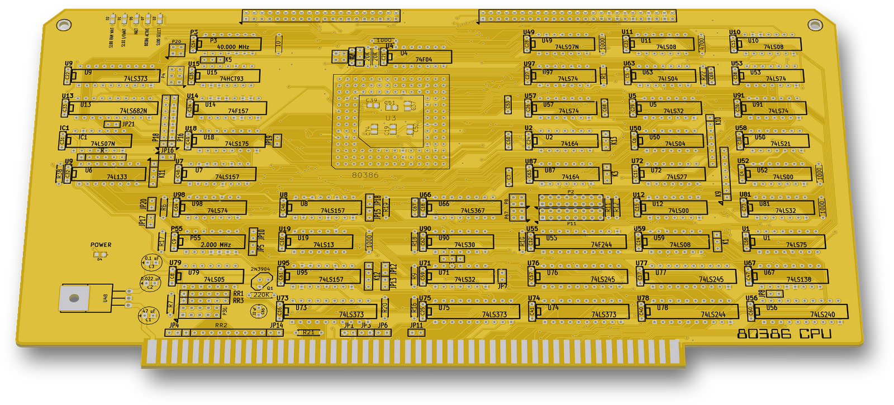
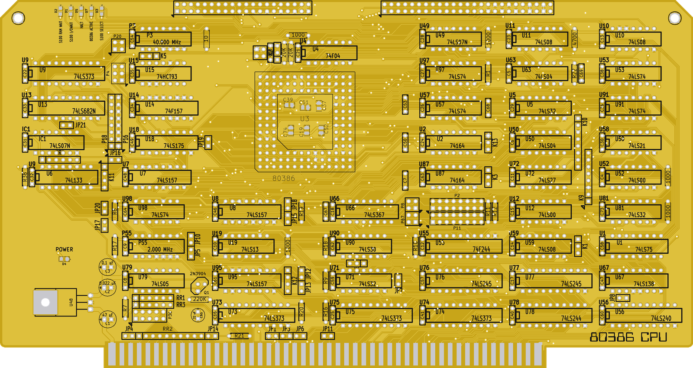
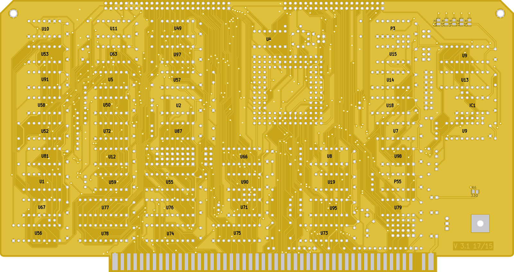

# 80386 CPU (V3.1)

An S-100 bus 80386 CPU card. It is mostly **John Monahan's S100Computers.com "S-100 80386 CPU Board, Version 3"**, with small changes by me (V3.1, 2014–2015). Full credit for the design goes to him.

 

## Status

Built. The gerbers were sent to PCBway on 28-07-2015. The original working folder holds a copy named `GERBERS/SENT to PCBway 28-07-2015/`, identical to `gerbers/` here.

The fabricated silkscreen says only "80386 CPU" (front) and "V 3.1 17/15" (bottom copper). It has no S100Computers.com text, because the original "S100Computers.com & N8VEM" and "S-100 80386 CPU BOARD VERSION 03" lines were removed in V3.1. The board files are kept as fabricated, and the credit is in this README.

## Hardware

| Ref | Part | Role |
|---|---|---|
| U3 | 80386 (PGA-132) | CPU |
| P3 / P55 | 40.000 MHz / 2.000 MHz | oscillators (14-pin DIP) |
| U13 | 74LS682 | compares A24–A31 |
| U9, U73, U74, U75 | 74LS373 | address latches |
| U76, U77 / U78 / U55 / U56 | 74LS245 / 74LS244 / 74F244 / 74LS240 | bus buffers |
| U7, U8, U95 / U14 | 74LS157 / 74F157 | multiplexers |
| U2, U87 | 74164 | shift registers |
| U66 | 74LS367 | drives the status LEDs |
| U48 | LDO 7805 (TO-220) | +5 V from the S-100 +8 V rail |
| Q1 | 2N3904 | |

- Board: 254.0 x 134.62 mm (10.0 x 5.3 in, including the edge connector), 2 layers.
- KiCad (2013-07-07 BZR 4022)-stable. The files are in the legacy `.sch` / `.brd` formats.
- LEDs: D2 "S100 RAM WAIT", D1 "S100 I/OWAIT", D5 "HALT", D7 "80386 ACTIVE", D3 "S100 SELECT", D4 "POWER".
- Jumpers and headers: JP1, JP3–JP21 and K1–K13. Also:
  - P10 (20x2): CPU address lines;
  - P12 (25x2): D0–D31 and 80386-RESET;
  - P2 / P11 (8x2);
  - P36 (5x2): TMA0*–TMA3* bus-master selection.

## How it works

- The 386 runs on the S-100 bus through TTL latches and buffers. The schematic notes label the data buffers "EVEN TO CPU 8 BITS", "ODD FROM CPU 8 BITS", "ODD TO CPU 8 BITS" and "EVEN FROM CPU 8 BITS".
- U13 (74LS682) compares the top address bits A24–A31. The schematic notes mark "LOW FOR RAM > 16M" and "LOW/HIGH FOR S-100 BUS ACCESS".
- A schematic note reads "FORCE FFFFFFF0 TO 000FFFF0 TO PC BIOS/MONITOR".
- S-100 signals used include:
  - pSYNC, pSTVAL*, pDBIN, pWR*, MWRT and sINTA;
  - RDY, XRDY, HOLD* and pHLDA;
  - TMA0*, SLAVE_CLR*, sXTRQ* and PHANTOM*;
  - RESET*, INT*, NMI* and ERROR*.
- S-100 pins 20 and 70 go to GND through JP1 and JP3.

### Changes in V3.1 (compared with John Monahan's V3 files of 30 May 2014)

- The 7805 in a TO-3 package was replaced by an LDO 7805 in TO-220 (U48). C1 changed from 33 µF to 47 µF, and C2 (0.022 µF) was added.
- POWER LED D4 with R6 (330 Ω) added.
- The status LEDs D1/D2/D3/D5/D7 became 0805 SMD parts with their own 330 Ω resistors (R31–R35). They replace the 470 Ω resistor pack RR4.
- Six decoupling capacitors inside the 386 socket (C19, C37, C39, C51, C52, C74) became 0805 SMD parts.
- JP2 (S-100 pin 53 to GND) was removed, and so was edge finger 53.
- GND copper pours were added on both layers, and IC reference labels on both sides.
- An "80386 CPU" logo was added, along with rounded shoulders at the edge connector.
- About 96 % of the original tracks are unchanged.

## Files

| Path | What |
|---|---|
| `s100_80386 V3.sch`, `s100_80386 V3-cache.lib` | Schematic and its symbol cache |
| `s100_80386 V3.brd` | PCB layout (as fabricated) |
| `s100_80386 V3.net`, `.cmp`, `.pro` | Netlist, footprint assignments, project |
| `gerbers/` | Gerbers sent to PCBway (the `.drl` is an RS-274X file exported by gerbv) |
| `s100_80386 V3.csv`, `.xlsx` | IC parts list |

## History

The git history replays the files of the original working folder at their save dates (2014-07-18 to 2016-01-10).

## Things to check (TODO)

- U6 (74L133) is labelled "U9" on both silkscreen sides, so "U9" appears twice on each side.
- Edge finger 53 is missing from the S-100 connector footprint (99 of 100 pads). JP2 was removed with it.

## Credits

- **This board is mostly John Monahan's design** (S100Computers.com): the circuit, the parts and almost all of the layout. Full credit goes to him. The original V3 board carried the silkscreen line "S100Computers.com & N8VEM".
- The schematic symbols come from the N8VEM KiCad libraries.

## License

John Monahan's original design is his work. His rights are not relicensed here (see the repo NOTICE).

The repository licence covers only my own changes listed above. For hardware that is CERN-OHL-S-2.0; for docs and images it is CC-BY-4.0.
