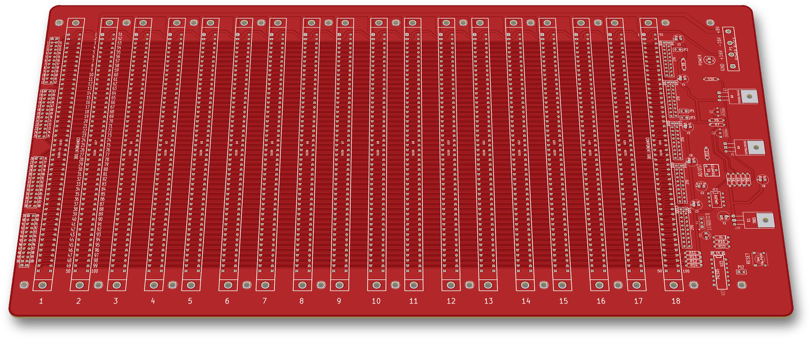
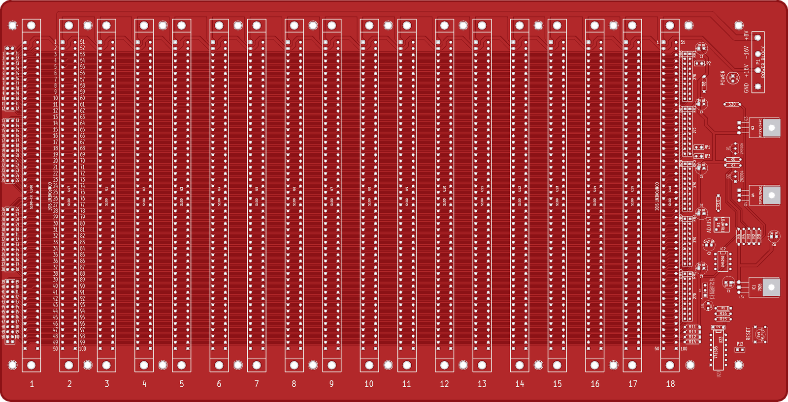
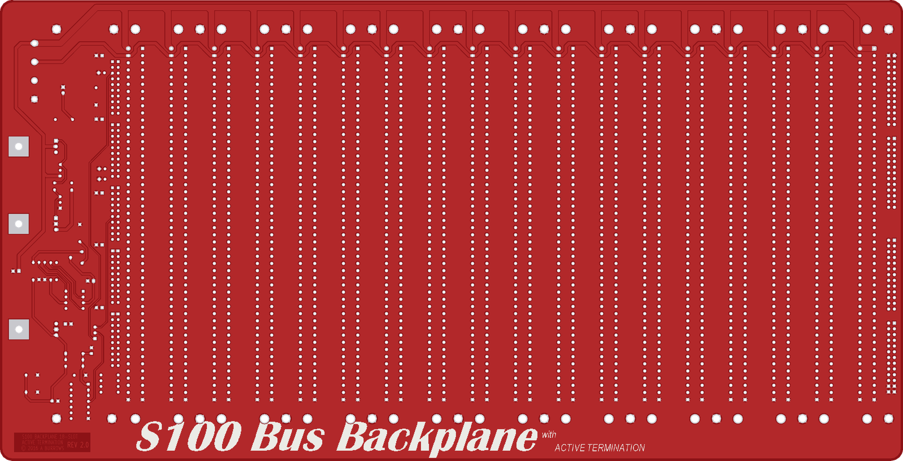

# S100 Backplane 18-Slot

An 18-slot S-100 bus backplane with on-board active termination. Rev 1.0 is from 2013–2014 and Rev 2.0 from 2015–2016.

 

## Status
Built. Both Rev 1.0 and Rev 2.0 were made. Rev 1.0 has a red solder mask.

## Hardware
- **Board:** 15.70 × 8.00 in (398.8 × 203.2 mm), 2 layers, rounded corners. The outline is the same for both revisions.
- **Slots:** 18 S-100 100-pin connectors at 0.75 in pitch. The silkscreen numbers them 1–18. All 18 are wired pin-for-pin in parallel.
- **Board text:**
  - Rev 1: back copper reads `S100 BACKPLANE 18SL`, `© 2014 A BURROWS`, `REV 1.0`.
  - Rev 2: back copper reads `S100 BACKPLANE 18-SLOT`, `ACTIVE TERMINATION`, `© 2016 A BURROWS`, `REV 2.0`.
  - The back silkscreen of both carries the "S100 Bus Backplane with ACTIVE TERMINATION" logo.
- **KiCad:** EESchema/Pcbnew (2013-07-07 BZR 4022)-stable. These are legacy `.sch`/`.brd` files.

| Ref | Part | Role |
|---|---|---|
| IC2 | LM4250 | Programmable op-amp that regulates the termination rail (`Vacc`) |
| Q1, Q2 | 2N3906, 2N3904 | Drivers, switched by the LM4250 supply currents |
| Q3, Q4 | TIP29 / D44C (NPN), TIP30 / D45C (PNP) | Push-pull pass transistors from +8 V and to GND |
| R1 | Trimpot (silk "ADJUST") | Sets the termination voltage |
| RR1–RR10, R11–R14 | 270 Ω SIP networks + 4 resistors | Terminate 94 bus lines to `Vacc` |
| IC1 | 7805 | Local +5 V for the reset logic, reference divider and POWER LED |
| U23 | 74LS05 (Rev 2) / 74LS04 (Rev 1) | Reset buffer |
| SW1, P12 | Push button / 2-pin header | RESET button / external reset button |
| K1 | 3-pin header | Reset target: 1-2 /EXTCLR (pin 54), 2-3 /PRESET (pin 75) |
| JP1, JP2, JP3 | 2-pin jumpers | Tie bus pin 20, 53 or 70 to GND |
| P1 | 4-way barrier strip "POWER BLOCK" | Power input: GND, +16 V, −16 V, +8 V |
| D12 | LED (silk "POWER") | +5 V power indicator (R47 330 Ω) |
| P25–P28 | 2×13 headers | Together bring out all 100 bus pins |

## How it works
- **Power:** comes in on P1.
  - +8 V goes to bus pins 1 and 51, +16 V to pin 2 and −16 V to pin 52.
  - GND goes to pins 50 and 100.
  - The 7805 (IC1) makes a local +5 V from the +8 V rail.
- **Active termination:**
  - Every bus line except the power and ground pins (94 lines) has a 270 Ω resistor to the `Vacc` rail.
  - The LM4250 (IC2) holds `Vacc` at a voltage set by the R9 / R1 / R10 divider from +5 V (R1 is the "ADJUST" trimpot, filtered by C2). It is biased by R2 150K and has R4 1K feedback.
  - Its supply currents flow through R5 and R3 (560 Ω) and turn on Q1 and Q2. These drive Q3, which sources current from +8 V, and Q4, which sinks it to GND.
  - C3–C7 (39 µF) decouple the rail.
- **Reset:**
  - R16 10K and C13 10 µF make a power-on delay, and D1 discharges C13 at power-off. SW1 (or a button on P12) pulls the node low through R15 10 Ω.
  - Two inverters of U23 buffer it. K1 sends the result to /EXTCLR (pin 54) or /PRESET (pin 75).
- **Jumpers:** JP1, JP2 and JP3 can ground pins 20, 53 and 70.

## Revisions
| Folder | Board text | Dates | Changes |
|---|---|---|---|
| `rev1/` | REV 1.0, © 2014 | Aug 2013 – Mar 2014 | First version. The POWER LED is switched by Q13 2N3904 / R46 1K. U23 is a 74LS04. |
| `rev2/` | REV 2.0, © 2016 | Oct 2015 – Dec 2016 | Q13/R46 removed: the LED is fed from +5 V directly. U23 changed to a 74LS05 (open-collector). K1 moved. "ACTIVE TERMINATION" added to the board text. |

## Files
- `rev1/`
  - `S100-Backplane.sch`, `.brd`, `.pro`, `-cache.lib`: KiCad project.
  - `.net`, `.cmp`: netlist and component/footprint list.
  - `S100-Backplane.csv/.txt`: early BOM exports, Aug 2013.
  - `Gerbers/`: fabrication files, Mar 2014.
  - `BOM/`: bill of materials, Mar 2014.
- `rev2/`
  - `S100-Backplanev2.*`: KiCad project, netlist and component list.
  - `Gerbers/`: final fabrication set, Oct 2016. Most layers were post-processed in gerbv; the top copper is a KiCad export.
  - `Gerbers/kicad-export/`: the same design exported directly from KiCad, Oct 2016.
  - `BOM/`: BOM with Digi-Key part numbers (`.csv`, `.xlsx`).

Current KiCad versions need *Remap Symbols* to open the 2013-format schematics. Run it in the GUI with the included `-cache.lib`.

## History
The git history replays the original dated backups:
- Rev 1: 16 commits, Aug 2013 → Mar 2014.
- Rev 2: 3 commits, Dec 2015 → Dec 2016.

Early Rev 1 snapshots (Aug–Oct 2013) also contain the ATX PSU sub-board and some experimental logic (CPLD, FPGA, USB, MSX slot) in the same schematic and board. These were removed before the Rev 1.0 release.

## Things to check (TODO)
- **Rev 2 reference divider:** in the Rev 2 schematic, R1 (pins 1 and 3), R9 pin 1 and R10 pin 1 have no net. On the Rev 2 board they are joined by tracks that carry no net. Check the divider against Rev 1, where it is wired R9–R1–R10 in the schematic.
- **Net name for +16 V:** the +16 V input (P1 pin 3, bus pin 2) is named `+18_V` in the schematic, while the silkscreen says +16V.

## Credits
- **N8VEM S-100 backplane v02 (Andrew Lynch, N8VEM).** This design started from that KiCad project, an 8-slot backplane. The two share the active-terminator section with the same reference designators and values. The S-100 connector symbol is from the N8VEM-KiCAD library.
- **Godbout Electronics / CompuPro Active Terminator (1981).** The termination circuit follows this design: LM4250, 2N3904/2N3906, D44C/D45C, trimpot, 270 Ω bus resistors. The same circuit is used on the N8VEM and S100Computers.com (John Monahan) backplanes.

## License
Hardware: CERN-OHL-S-2.0 for the original work in this folder. See the repo NOTICE for third-party parts.
