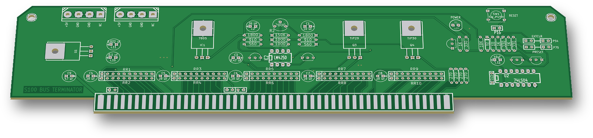

# S100 Bus Terminator

"S100 BUS TERMINATOR / REV 1.0": a plug-in active bus terminator card for an S-100 system (2014).

 

## Status

Built. The fab gerbers are in `GERBERS/` and are dated 3 August 2014. They include top/bottom copper, top silkscreen, both masks, Edge.Cuts and an Excellon drill file. There is no bottom silkscreen layer.

## Hardware

| Ref | Part | Role |
|---|---|---|
| IC2 | LM4250 (8-DIP) | Micropower op-amp, voltage follower for the termination rail `Vacc` |
| Q1 / Q2 | 2N3906 / 2N3904 | Driven from the LM4250 supply pins |
| Q3 / Q4 | TIP29 / TIP30 (TO-220) | Push-pull pass pair: sources from +8 V and sinks to GND |
| R2 | 2 kΩ trimmer | Sets `Vacc` (divider R1/R2/R3 = 1800/2000/1800 Ω on +5 V) |
| RR1–RR10 | 9 × 270 Ω SIP networks | Line terminations to `Vacc` |
| R19–R22 | 270 Ω | Terminations on pins 48, 49, 98, 99 |
| IC1 | 7805 (TO-220) | +5 V for the logic and the reference |
| U1 | 5 V regulator (TO-220) | Separate +5 V for P2/P3 |
| P2, P3 | 4-pin Molex drive-power headers | +5V / GND / GND / NC |
| U2 | 74LS04 | Reset buffer |
| Q5, Q6, Q7 | 2N3904 | POWER LED driver; /PRESET and /EXTCLR open-collector drivers |
| C4–C8 | 39 µF | Rail decoupling |

- **Board:** 2-layer, 10.0 × 2.0 in (254.0 × 50.8 mm) plus the edge-finger tab, 2.3 in (58.4 mm) overall. There is a ground pour on both layers.
- **Silkscreen labels:**
  - RESET (SW1) and P16 (2-pin header for an external reset button);
  - POWER (D1);
  - PRESET / P75 and EXTCLR / P54 (output jumpers);
  - +5V (P2, P3).
- **Jumpers:**
  - JP1 / JP3 / JP2 tie S-100 pins 20 / 70 / 53 to GND;
  - JP4 + JP7 route the reset to /PRESET (pin 75);
  - JP5 + JP6 route the reset to /EXTCLR (pin 54).
- **Tools:** KiCad (2013-07-07 BZR 4022)-stable, legacy `.sch` / `.brd` format.

## How it works

- **Termination rail:** a 270 Ω resistor connects each of 94 S-100 lines to `Vacc`. That is every pin except +8 V (1, 51), ±16 V (2, 52) and GND (50, 100).
- **Rail control:** the LM4250 follows the trimmer voltage, and its supply-pin currents drive Q1/Q2, which drive Q3/Q4. The rail can therefore both source and sink current. With these divider values the trimmer covers about 1.6–3.4 V.
- **Power:** +8 V from the bus feeds IC1 (logic and reference) and U1 (the two drive-power headers).
- **POWER LED:** D1 lights whenever the +5 V logic supply is present.
- **Reset:**
  - SW1 or P16 discharges a 10 kΩ / 10 µF power-on delay, with D2 as the discharge diode.
  - Two 74LS04 gates buffer it.
  - Q6/Q7 then pull /PRESET and/or /EXTCLR through the jumpers.
- The same active-terminator circuit was earlier part of the 18-slot backplane Rev 1.0 (see `../Backplane-18-Slot/`).

## Files

| Path | Contents |
|---|---|
| `S100_Bus Terminator.sch` | Schematic (KiCad legacy) |
| `S100_Bus Terminator-cache.lib` | Symbol cache. Needed to open the schematic in newer KiCad (Remap Symbols) |
| `S100_Bus Terminator.brd` | PCB (KiCad legacy) |
| `S100_Bus Terminator.pro` | KiCad project |
| `S100_Bus Terminator.net`, `.cmp` | Netlist and footprint assignments |
| `GERBERS/` | Fab gerbers and drill file |

## History

The git history replays the original dated backups from 3 August 2014 (11:53 to 13:25 NZST): placement, then re-placement, then the routed board with gerbers.

## Things to check (TODO)

- **Reset polarity:** U2 has two inverters in series (pins 1→2→3→4), so its output follows the RC node. That node is high when the button is released. Check whether Q6/Q7 then conduct and hold /PRESET and /EXTCLR low while JP4/JP7 or JP5/JP6 are fitted.

## Credits

- **Termination circuit:** Godbout Electronics / CompuPro S-100 "Active Terminator" (Bill Godbout Electronics; CompuPro board © 1980). This card has the same LM4250 reference with a complementary-transistor booster, the same component values (1.8 k / 2 k trimmer / 1.8 k, 150 k, 560 Ω, 910 Ω, 39 µF) and the same count of 94 × 270 Ω terminations, with renumbered reference designators.
- **KiCad library parts:** some come from the N8VEM KiCad library: the op-amp symbol used for the LM4250 (`o_analog.lib`) and the `molex-drive-connector` footprint.

## License

Hardware: CERN-OHL-S-2.0 for the original work in this folder; see the repo NOTICE for third-party parts.
