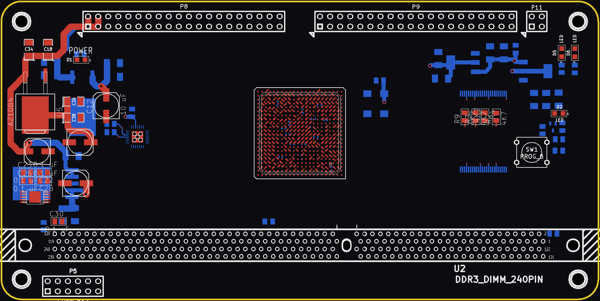

# 4GB DRAM Board (4Mem v2): unfinished

A Spartan-6 XC6SLX45 + DDR3 DIMM mezzanine for the [x86 32bit Memory Adapter Board](../x86-Memory-Adapter/). It plugs onto the adapter's P8/P9 headers and isn't an S-100 card itself (2015).

 

## Status
**Unfinished: schematic and placed, partly routed PCB only. It was never routed or built.**
- The `GERBERS/` folder in the original project is empty.
- None of the 124 DDR3 nets or the 74 P8/P9 signal nets has a track. The PCB file reports 478 unrouted connections.
- The board has no title or revision text.

## Hardware
| Ref | Part | Role |
|---|---|---|
| U1 | XC6SLX45-2FGG484C | FPGA, DDR3 interface to the adapter board |
| U2 | 240-pin DDR3 DIMM socket | 64-bit unbuffered DIMM, 2 ranks |
| U3 | XCF08P (TSOP48) | FPGA configuration flash |
| U12 | PIC18F2520 (QFN28) | on the DIMM SPD I2C bus, 6 lines to the FPGA |
| U9 | oscillator | FPGA clock into ball M3 (GCLK); a 62.5 MHz 2.5 V part in `digikey.xlsx` |
| U5 | AZ1084 | 3.3 V from +8 V |
| U6 | NCP565 | 1.2 V (FPGA core) |
| U7 | LT1764EQ-1.5 | 1.5 V DIMM supply |
| U8 | RT9026 | DDR3 VTT / VREF |
| U4, U10 | LM1117-1.8, LM1117-2.5 | XCF08P core, oscillator |
| P8, P9 | 2x20 headers | to the x86 32bit Memory Adapter Board |
| P11 | 2x2 header | JTAG (TDI, TDO, TMS, TCK) |
| P5 | 2x6 header | PIC programming (MCLR/PGD/PGC) and UART (TX/RX) |
| SW1 | push button | FPGA PROG_B |
| D1, D2 | LEDs | POWER, FPGA DONE (via Q1) |

- Board: 150.4 x 75.2 mm, rounded corners, four corner mounting holes, 6 copper layers (Top, GND, Sig1, Sig2, POWER, Bottom).
- KiCad (2013-07-07 BZR 4022)-stable.

## How it works (as drawn)
- **P8/P9:** these carry 72 FPGA I/O lines plus +8 V (P8 pins 1–4) and GND (P9 pins 39–40). The pins and positions match P8/P9 on the [x86 32bit Memory Adapter Board](../x86-Memory-Adapter/): its 32-bit data bus (bD0–31), address bA2–22 and CPLD lines.
- **DDR3:** the FPGA connects to the whole DIMM interface: A0–A15, BA0–2, DQ0–63, DQS0–7, DM0–7, CK0/CK1, CKE0/1, S0/S1, ODT0/1, RAS/CAS/WE.
- **Configuration:** the FPGA boots from the XCF08P (D0–D7, CCLK), which shares the JTAG chain with the FPGA. SW1 pulls PROGRAM_B.
- **DIMM reset:** FPGA DONE drives the DIMM RESET# pin (through R8, 0 Ω) and the DONE LED.
- **PIC18F2520:** reads the DIMM SPD EEPROM (SCL/SDA, 10K pull-ups) and has 6 lines to the FPGA.
- **Power:** the board makes all its rails from the +8 V on P8.

## Files
| File | What it is |
|---|---|
| `4Mem board v2.sch` | schematic (single sheet) |
| `4Mem board v2-cache.lib` | symbol cache |
| `4Mem board v2.kicad_pcb` | PCB (placed, partly routed) |
| `4Mem board v2.pro` | KiCad project |
| `4Mem board v2.net`, `.cmp` | netlist and footprint assignments |
| `digikey.xlsx` | DigiKey parts list (NZD), including parts for the sibling SRAM/adapter boards |

There is no FPGA project for this board.

## History
- The git history replays the original dated backups, from 2015-05-03 to 2015-06-21.
- The project started as a copy of the [4Mbit (128K x 32) SRAM module](../x86-Memory-Adapter/sram-module/). It has the same outline and P8/P9 positions, and the module's "4Mbit (128K x 32)" text is still in the PCB file, outside the board edge.
- The last file activity is an autorouter (Specctra `.dsn`) export of the same PCB on 2016-12-06. It isn't included.

## Things to check (TODO)
- **FPGA supplies:** nets `/V1.2temp`, `/V1.5temp` and `/V3.3temp` are not joined to the regulator outputs `/V1.2`, `/V1.5` and `/V3.3`.
- **U4/U10 input:** `/+8Vitemp`, the input to U4 and U10, is not joined to `/+8Vi`.
- **XCF08P supply:** the XCF08P I/O supply is on a separate net, `/V3.3temp2`.
- **Loose pins:** one side of LEDs D5 and D6, and the PIC PGM pin, are unconnected.
- **DDR3 balls vs memory controller:** the DDR3 balls don't follow the Spartan-6 hard memory controller (MCB) pinout. For example, A0 is on G19, an M1A10 ball. The 64-bit DIMM is also wider than one MCB.
- **Net name:** `/DDR3_OFT1` is the DIMM ODT1 signal.
- **JTAG header:** P11 has no GND or VREF pin.
- **Schematic title block:** it still says "noname.sch".
- **Copper planes:** no copper zones are poured on the GND or POWER layers.

## Credits
- The DDR3 pin assignment follows a Spartan-6 DDR3 UDIMM reference document.
- The FPGA symbol comes from the author's own KiCad library.

## License
Hardware: CERN-OHL-S-2.0 for the original work in this folder; see the repo NOTICE for third-party parts.
