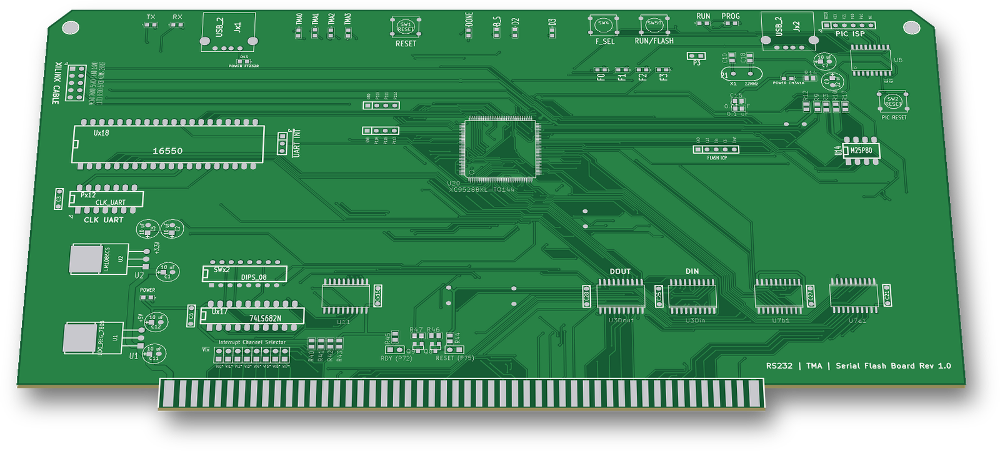
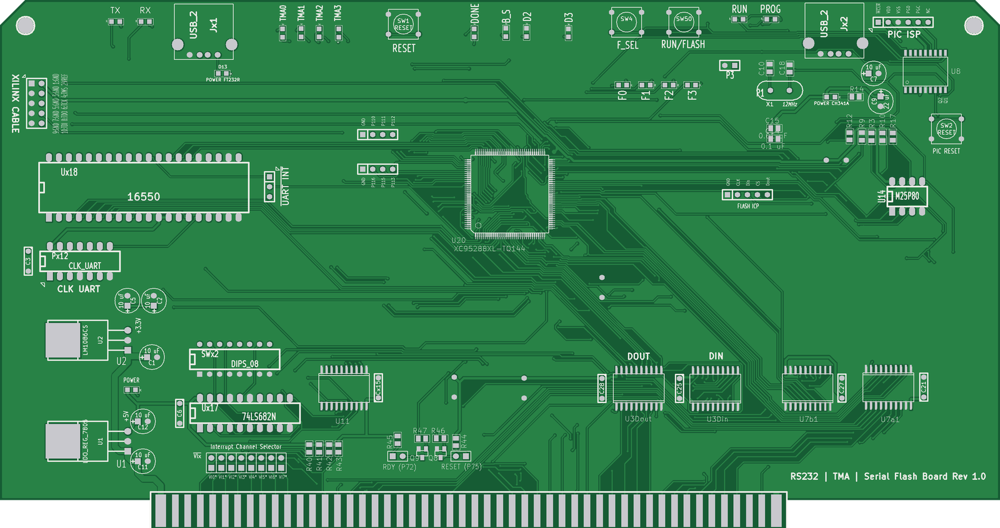
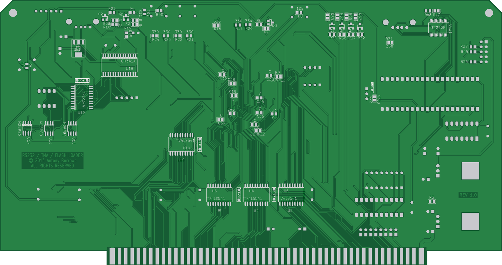

# RS232 | TMA | Serial Flash Board Rev 1.0

An S-100 board with a USB serial port (16550 + FT232R), four TMA* bus-master request lines, and four SPI flash chips. The flash chips can be loaded from a PC over USB and then read from the S-100 side (2014–2015).

 

The idea is fast development turnaround:
1. Program the SPI flash chips from a PC through the CH341A.
2. Flip the RUN/FLASH switch.
3. An S-100 monitor/loader reads the flash contents into RAM through the CPLD's I/O ports.

The S-100 monitor/loader and the PIC18F1330 firmware are **not** in this repo.

## Status
Built. The gerbers are dated 16 Apr 2014 (`GERBERS/`). The CPLD design was brought up in June 2014 and revised in July and December 2015.

## Hardware
| Ref | Part | Role |
|---|---|---|
| U20 | XC95288XL-TQ144 | CPLD: S-100 glue, port decode, SPI bit-bang registers, flash chip select |
| Ux18 | 16550 | UART (clock from oscillator socket Px12 "CLK UART") |
| Ux21 | FT232R | USB to serial for the UART (Jx1) |
| U18 | CH341A | USB to SPI flash programmer (Jx2, 12 MHz crystal X1) |
| U14–U17 | M25P80 | SPI flash chips on a shared bus (U14 on top, U15–U17 on the bottom) |
| U12 | 74LV244 | Switches the flash bus between the CPLD and the CH341A |
| U8 | PIC18F1330 | Reads the RUN/FLASH and F_SEL switches and drives the U12 enables |
| Ux17 | 74LS682N | UART I/O address compare against DIP switch SWx2 |
| U3din1, U3dout1 | 74LS541 | S-100 DO → local data bus, local data bus → S-100 DI |
| U4, U5, U6 | 74LS541 | Address buffers A0–A23 |
| U11 | 74LS541 | TMA0*–TMA3* drivers |
| U19 | 74LS541 | Puts the flash data-out bit on local D0 |
| U7a1, U7b1 | 74HC245 | S-100 status/control input buffers |
| U2, U1, Ux1 | LM1086CS, 7805, 3.3 V SOT-223 | Power |

- **Board:** 10.0 × 5.0 in (254 × 127 mm), plus the S-100 edge-connector tab.
- **KiCad:** pcbnew `(2013-07-07 BZR 4022)-stable`, legacy schematic format (`EESchema Schematic File Version 2`).
- **CPLD tools:** Xilinx ISE 14.7 (`P.20131013`), XC95288XL-10-TQ144.
- **Switches:** RESET (SW1), PIC RESET (SW2), F_SEL (SW4), RUN/FLASH (SW50), DIP switch SWx2 (UART address: A3–A7 on sw 1–5, IORQ on sw 6, sw 7 and 8 to GND).
- **LEDs:** TMA0–TMA3, DONE, B_S (board select), D2, D3, F0–F3 (flash selected), RUN, PROG, TX, RX, and power LEDs for the board, the FT232R and the CH341A.
- **Headers:**
  - XILINX CABLE (JTAG), PIC ISP, FLASH ICP (GND, CLK, Din, CS, Dout on the CH341A side), UART INT
  - CPLD I/O (P10: P110–P112, P2: P113/P115/P116)
  - RDY (P72), RESET (P75)
  - Interrupt Channel Selector (VI0*–VI7*)

## How it works
- **I/O request:** the CPLD makes IOREQ from sINP OR sOUT and passes it to the 74LS682. When A7–A3 and IOREQ match SWx2, the 74LS682 selects the 16550. A2–A0 go straight to the UART. The CPLD makes the UART's RD*/WR* strobes from pDBIN/pWR* and drives the two data-bus buffers.
- **SPI flash ports:** the CPLD decodes ports 90h–97h. A3 is not decoded, so 98h–9Fh mirror them. Each write latches D0, except port 96h, which takes D0–D2.

  | Port | Function |
  |---|---|
  | 90h | CLK |
  | 91h | Din (data to flash) |
  | 92h | CS |
  | 93h | read flash data-out on D0 |
  | 94h | DONE LED |
  | 95h | bit 0: flash select source |
  | 96h | bits 2..0: flash number |

  A loader bit-bangs SPI through these ports.
- **Flash chip select:** the CS from whichever side owns the bus (CPU or CH341A) goes through a 3-to-8 decoder in the CPLD to FLASHSEL0–3 (U14–U17). LEDs F0–F3 show which chip is selected.
  - After reset (port 95h bit 0 = 0) the selection is U16. A note in the CPLD schematic says this position was used for a 256 KB 25L020 "for quick programming".
  - With bit 0 = 1, port 96h picks the chip.
  - In the 2014 CPLD versions the PIC chose the chip instead, through lines PIC18F_0..2.
- **CH341A or S-100:** all four flash chips share CLK/Din/Dout. One half of the 74LV244 connects them to the CPLD, the other half to the CH341A and the FLASH ICP header. The PIC18F1330 enables one half or the other, following the RUN/FLASH switch. At power-up the CPLD (S-100) side has the bus.
- **TMA:** an OUT to port **EEh** latches D0–D3 onto TMA0*–TMA3* (S-100 pins 55, 56, 57, 14) through U11. In U20v2 a 1 asserts the line (low), and reset leaves all four lines high.
- **Reset:** S-100 SLAVE_CLR*, the RESET button or a PIC line clears the CPLD registers and resets the UART. The RESET button also pulls S-100 RESET* (pin 75) through Q8 and jumper JP4.
- **UART:** the 16550's TTL serial lines (SIN, SOUT, RTS, CTS, DTR, DSR) go to the FT232R and USB socket Jx1. The UART interrupt goes to the "UART INT" jumper.

## Files
| Path | What |
|---|---|
| `S100_B1FU.sch`, `S100_B1FU-cache.lib`, `S100_B1FU.pro` | KiCad schematic, symbol cache, project |
| `S100_B1FU.kicad_pcb` | KiCad PCB |
| `S100_B1FU.net`, `S100_B1FU.cmp` | Netlist and component/footprint list |
| `GERBERS/` | Fabrication gerbers and drill file (16 Apr 2014) |
| `cpld/U20v2.sch` | Current CPLD schematic (Xilinx ISE schematic, XML) |
| `cpld/U20v1.sch` | Previous CPLD schematic (July 2015) |
| `cpld/pinmap.ucf` | CPLD pin constraints |
| `cpld/S100BFURev1/S100BFURev1.xise` | ISE project (top: `../U20v2.sch`, constraints `../pinmap.ucf`) |
| `cpld/S100BFURev1/U20v1.jed`, `U20v2.jed` | Programming files |
| `cpld/outdated/` | The first U20 test schematic and pin map (May 2014) |

## History
The git history replays the original dated backups of the KiCad project and the CPLD project, from April 2014 to December 2015.

## Things to check (TODO)
- On the PCB, 16550 (Ux18) pins 18 (WR*), 21 (RD*) and 35 (MR) have no net. The CPLD's RD, WR and RESET outputs (pins 113, 116, 115) only go to header P2. Check the wiring from P2 to the UART.
- CPLD pin 39 (`IOREQtoUx17`, an output) and U7a1 pin 6 (74HC245 output from S-100 pin 69) are on the same net (`/IOREQbb`). Check that only one of them drives it.

## Credits
- The UART section (16550 and FT232R with TTL serial labels, and its schematic notes) follows the N8VEM ECB SBC V2 schematic. Credit to Andrew Lynch and the N8VEM project.
- KiCad symbol libraries include N8VEM community libraries.

## License
Hardware: CERN-OHL-S-2.0 for the original work in this folder; see the repo NOTICE for third-party parts. The bottom-copper text "© 2014 Antony Burrows ALL RIGHTS RESERVED" is left as fabricated; this license applies.
