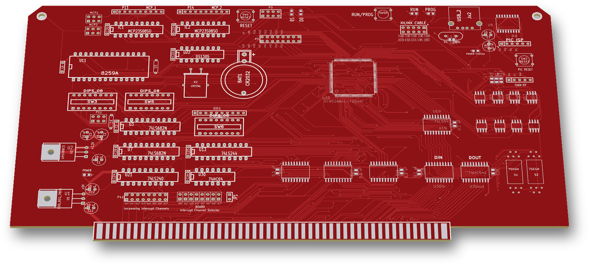
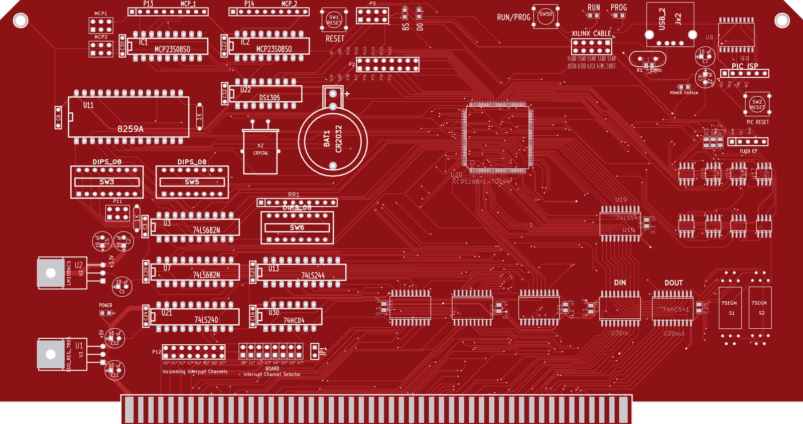
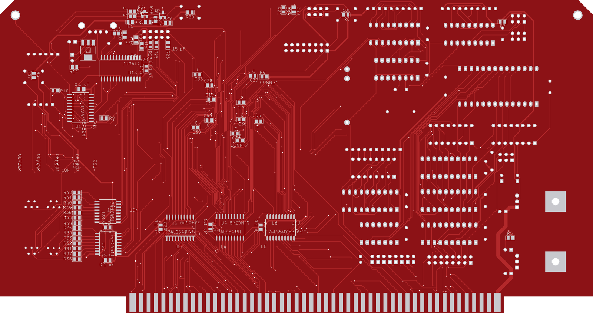

# PIC-SPI

An S-100 interrupt and SPI board: an 8259A interrupt controller on the bus vectored-interrupt lines, an XC95288XL CPLD driving an SPI bus (DS1305 RTC, two MCP23S08 port expanders) and eight M25P80 SPI flash chips that can be loaded over USB (2016). The project name is `S100 PIC_SPI_v1`; the board carries no title text.

 

## Status
Built.

## Hardware

| Ref | Part | Role |
|---|---|---|
| U20 | XC95288XL-TQ144 | CPLD: S-100 bus logic, chip selects, SPI master, flash select, 7-segment data |
| U11 | 8259A | Interrupt controller on VI0*–VI7*, output to INT* |
| U22 | DS1305 + X2 + BAT1 (CR2032) | SPI real-time clock with battery backup |
| IC1, IC2 | MCP23S08 | SPI 8-bit port expanders, brought out on P13 "MCP_1" and P14 "MCP_2" |
| U14–U17, U23–U26 | M25P80 ×8 | 8 Mbit SPI flash each, one select line per chip from the CPLD |
| U18 | CH341A (12 MHz X1, USB Jx2) | USB-to-SPI bridge for loading the flash |
| U8 | PIC18F1330 | Switches the flash SPI bus between the CPLD and the CH341A |
| U12 | 74LV244 | Flash SPI bus switch, enabled by the PIC18F1330 |
| U3, U7 | 74LS682 | Address compare against DIP switches SW3 and SW5 (U7 → 8259 select) |
| U21 | 74LS240 | Inverts VI0*–VI7* to the 8259 IR0–IR7 inputs |
| U13 + SW6 | 74LS244 + DIP switch | Interrupt vector byte set by switch, put on the bus by the CPLD |
| U27, U28 + S1, S2 | 74HC4511 ×2 + 7-segment ×2 | Two-digit display driven by the CPLD |
| U4–U6, U19, U31, U3din1, U3dout1, U9, U10 | 74xx541 / 74HC245 | S-100 address, data and status buffers |
| U1, U2, Ux1 | 7805-type LDO, LM1086CS, 3.3 V SOT-223 | +5 V and 3.3 V from the S-100 +8 V rail |

- Board size: 254.0 × 134.1 mm (10.0 × 5.28 in), standard S-100 outline, 2 layers.
- KiCad: 2013-07-07 stable (BZR 4022); `.kicad_pcb` format version 3.
- Headers: P12 "Incomming Interrupt Channels" (jumpers route each VIx* line to 8259 IRx); JPx1–JPx8 "BOARD Interrupt Channel Selector" (picks the VIx* line for the board's own interrupt); JP1 (8259 INT to S-100 INT*); P19 "XILINX CABLE" (JTAG); P5 "PIC ISP"; P1 "FLASH ICP" (GND/CLK/Din/CS/Dout); P3 "EXT SPI"; P2 spare CPLD I/O.
- Switches: SW1 "RESET", SW2 "PIC RESET", SW50 "RUN/PROG"; DIP switches SW3, SW5 (address) and SW6 (interrupt vector).
- LEDs: "RUN", "PROG", "BS" (board select), "D0", "POWER", "POWER CH341A".

## How it works
- The CPLD sits behind buffered S-100 address (A0–A23), data (DI0–DI7, DO0–DO7) and status/control lines (sINP, sOUT, sMEMR, sM1, sINTA, sWO*, pDBIN, pWR*, MWRT, PHI, CLOCK*, RESET*, SLAVE_CLR*).
- Interrupts: incoming VI0*–VI7* reach the 8259A IR inputs through P12 jumpers and a 74LS240; the 8259A INT output goes to S-100 INT* (pin 73) through JP1. The 8259A chip select is decoded by U7 (CPLD pin 69 `in8259CS*`) and driven back out by the CPLD (pin 70 `out8259CS*`).
- The CPLD can also raise its own interrupt (pin 110 `BOARD_INTERRUPT_VECTb`) on any one VIx* line chosen with JPx1–JPx8, and can put a switch-set vector byte (SW6 via U13) on the data bus.
- SPI: CPLD pins 57/58/59 are SPI CLK/Din/Dout to the DS1305, both MCP23S08s and P3. Chip selects come from CPLD pins 25 (DS1305), 26/27 (IC1/IC2) and 17 (P3).
- Flash: the eight M25P80s share one SPI bus with a separate select each (CPLD pins 80–83 and 85–88). The 74LV244 connects that bus either to the CPLD or to the CH341A USB bridge; the PIC18F1330 controls which.
- The CPLD can also drive the S-100 bus-master request lines TMA0*–TMA3* and sXTRQ*.
- No CPLD project for this board is in the backups.

## Files
All files are in this folder:

| File | What it is |
|---|---|
| `S10_PIC_SPI_v1.sch` | Schematic (single sheet) |
| `S10_PIC_SPI_v1-cache.lib` | Symbol cache for the schematic |
| `S10_PIC_SPI_v1.kicad_pcb` | PCB layout |
| `S10_PIC_SPI_v1.net` | Netlist |
| `S10_PIC_SPI_v1.cmp` | Footprint assignments |
| `S10_PIC_SPI_v1.pro` | KiCad project |

## History
The git history replays the original dated KiCad backups, 3–10 January 2016. The first commit is the Flash-UART layout with its tracks removed, and the Flash-UART netlist and footprint files are carried over unchanged.

## Things to check (TODO)
- The P2 header silkscreen labels (P71–P78, P110–P116) are Flash-UART net names; on this board those pins go to CPLD pins 105–100 and 93–98.
- The final layout reports 1 unrouted connection.

## Credits
- Started from the user's own [Flash-UART](../Flash-UART) design.
- The S-100 edge connector symbol (`S100_MALE`) comes from the N8VEM KiCad library.
- John Monahan's 8259A test programs for his S100Computers.com PIC/RTC board (2010) were kept in the original project folder as reference. They are not included here.

## License
Hardware: CERN-OHL-S-2.0 for the original work in this folder; see the repo NOTICE for third-party parts.
