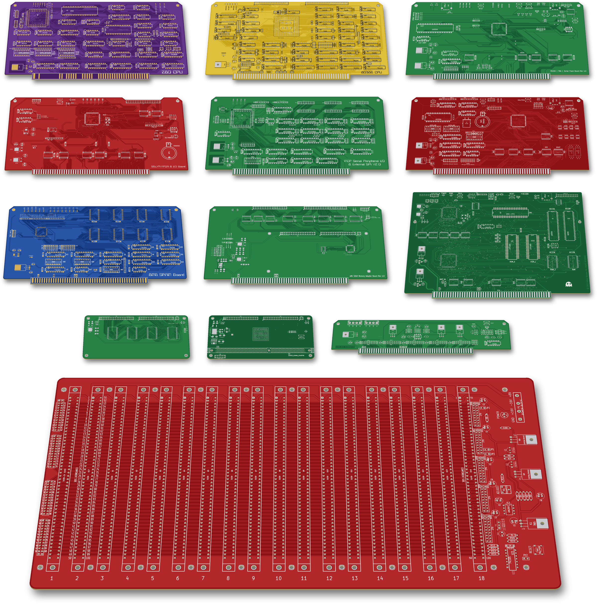
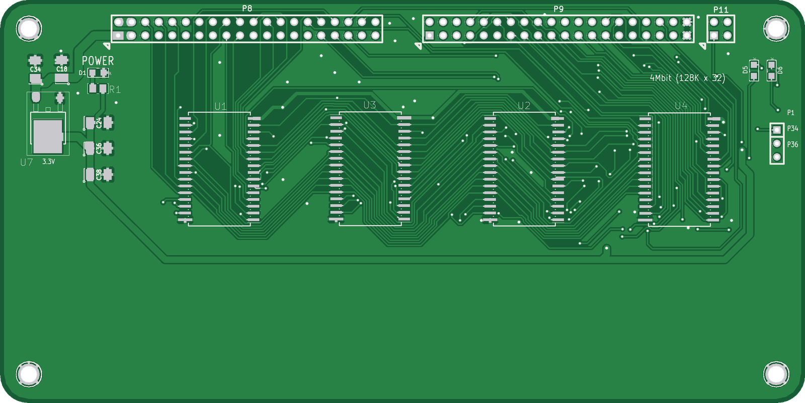
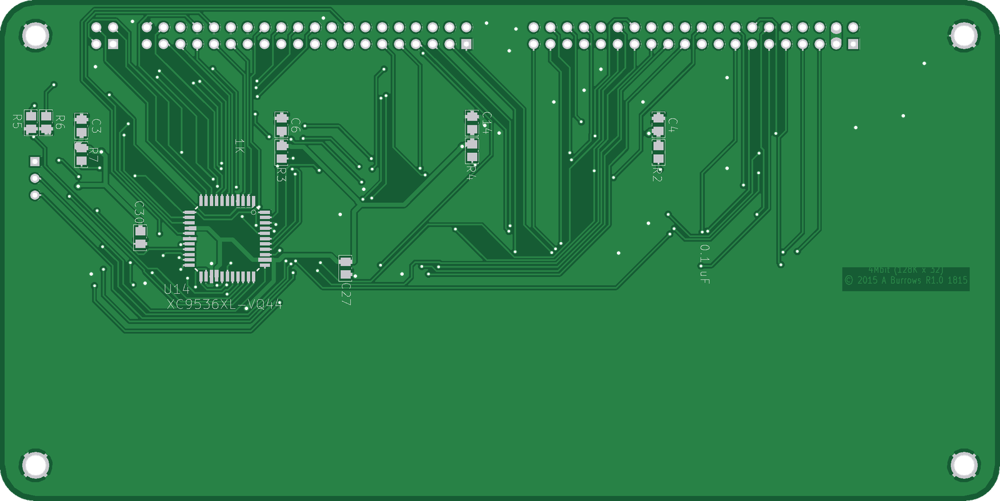
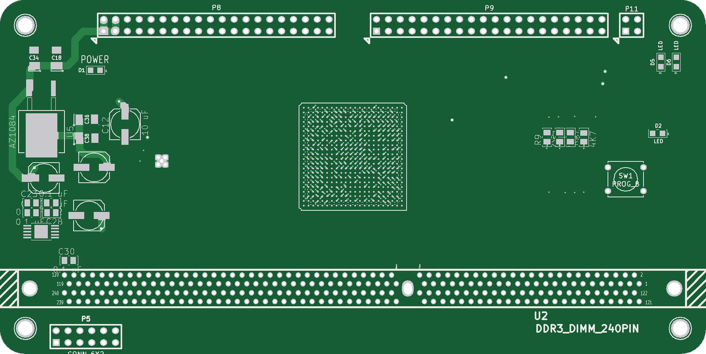
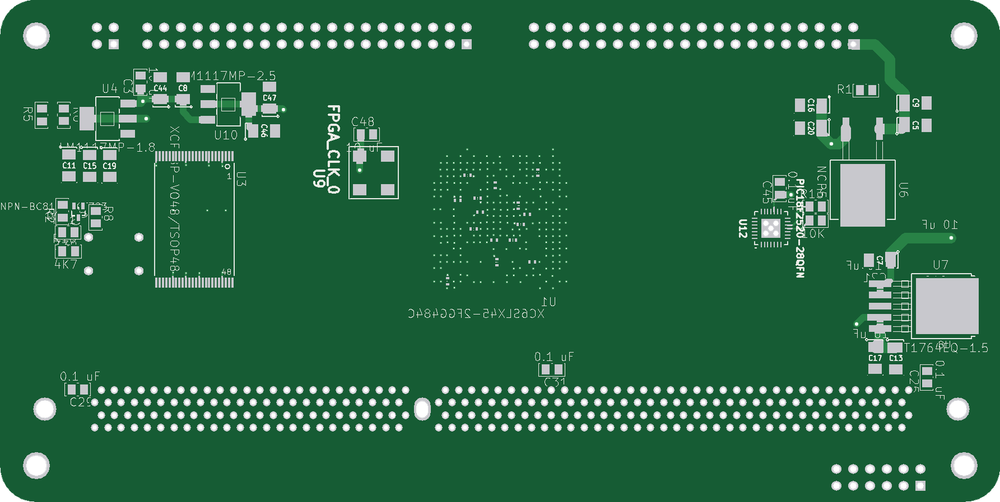
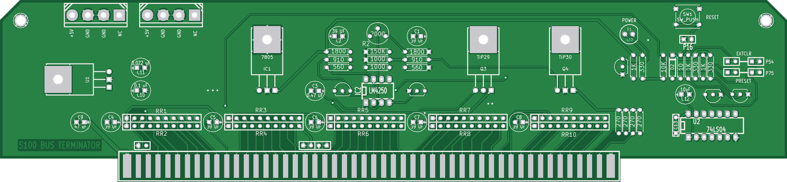
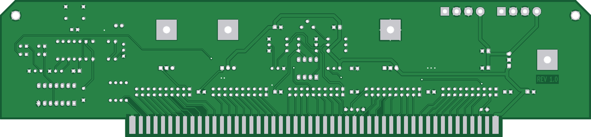

# S100-Boards

S-100 bus boards designed, laid out and built for a home-built S-100 system between 2013 and 2016: Z80 and 80386 CPU cards, static and dynamic memory, I/O and SPI peripheral cards, an 18-slot backplane and bus termination. The designs are in KiCad, with Xilinx CPLD and FPGA logic on most boards.

## Background

The S-100 bus began with the MITS Altair 8800 in 1975 and was standardised as IEEE-696 in 1983. Hobbyists still design new boards for it today. John Monahan's S100Computers.com and the N8VEM project are two well-known sources, and several boards here started from their designs.

This work ran from 2013 to 2016:
- **2013:** a Z80 single-board computer and the 18-slot backplane.
- **2014:** the Z80 CPU card, the 8MB SRAM boards, the serial-flash development board and the Spartan-6 I/O card.
- **2015:** the CPLD versions of the Z80 card, the 80386 CPU card, the SPI I/O board and the 32-bit memory experiments.
- **2016:** a revised backplane and the 8259A/SPI board.

The original S-100 cards of the 1970s and 80s were built from dozens of TTL chips, and later from HCMOS. A thread running through these boards is to move that glue logic into Xilinx CPLDs (XC9572, XC9572XL, XC95288XL) and Spartan-6 FPGAs. This covers bus status decoding, board select and address compare, memory bank and chip-select decoding, and I/O port decoding.
- **8MB SRAM board:** Rev 1 uses 27 TTL logic chips. Rev 2 does the same job with 14, one of them an XC9572XL.
- **Z80 CPU card:** from REV 4.0 an XC9572 takes over the S-100 status and control logic.
- **Other boards:** the CPLD or FPGA implements I/O ports and SPI interfaces that would otherwise need extra discrete logic.

## Boards

| Board | Folder | What it is | Status |
|---|---|---|---|
| Z80 CPU | [`Z80-CPU/`](Z80-CPU/) | Z80 bus-master CPU card, four revisions (REV 1.0–5.0); XC9572 CPLD from REV 4.0 | Built (all revisions) |
| 80386 CPU (V3.1) | [`80386-CPU/`](80386-CPU/) | John Monahan's S100Computers 80386 CPU board with small changes | Built |
| 18-slot backplane | [`Backplane-18-Slot/`](Backplane-18-Slot/) | 18-slot motherboard with active termination, Rev 1.0 and Rev 2.0 | Built (both) |
| Serial Flash board | [`Flash-UART/`](Flash-UART/) | USB UART, TMA lines and four SPI flash chips loaded over USB (CH341A); XC95288XL CPLD | Built |
| S6LX9 FPGA & I/O | [`S6LX9-FPGA-IO/`](S6LX9-FPGA-IO/) | Spartan-6 XC6SLX9 I/O card with RTC and serial RAM/flash | Built |
| MCP Serial Peripheral I/O | [`XC9500-IO/`](XC9500-IO/) | XC9572 CPLD + 12× MCP23S08 SPI port expanders (96 I/O lines) | Built |
| PIC-SPI | [`PIC-SPI/`](PIC-SPI/) | 8259A interrupt controller, SPI RTC/port expanders, 8× SPI flash; XC95288XL CPLD | Built |
| 8MB SRAM | [`SRAM-8MB/`](SRAM-8MB/) | 16 × 512 KB SRAM card, Rev 1 (TTL) and Rev 2.0 (XC9572XL CPLD) | Built (both) |
| x86 Memory Adapter + 4Mbit module | [`x86-Memory-Adapter/`](x86-Memory-Adapter/) | 32-bit memory adapter card (XC9572XL) and a 128K × 32 SRAM mezzanine (XC9536XL) | Module built; adapter not built |
| 4GB DRAM | [`DRAM-4GB-Unfinished/`](DRAM-4GB-Unfinished/) | Spartan-6 XC6SLX45 + DDR3 DIMM mezzanine for the memory adapter | Unfinished |
| Bus terminator | [`Bus-Terminator/`](Bus-Terminator/) | Plug-in active S-100 bus terminator | Built |
| Z80 FPGA SBC | [`Z80-FPGA-SBC/`](Z80-FPGA-SBC/) | 2013 Z80 single-board computer with XC95288XL CPLD and XC6SLX9 FPGA | Not built |
| SX6-MEM | [`SX6-MEM/`](SX6-MEM/) | Spartan-6 + SDRAM DIMM daughterboard, schematic only | Unfinished |
| NOR-SRAM loader | [`NOR-SRAM-Loader/`](NOR-SRAM-Loader/) | XC9572XL CPLD design for a serial-NOR-to-SRAM loader board | CPLD only |

Each folder has its own README with the parts, how the board works, the files, and a short "Things to check" list where something in the files looks worth a second look.

## Board views

Front and back of each board, rendered from its fabrication gerbers (or from the PCB file where no gerbers were made).

### Z80 CPU: [`Z80-CPU/`](Z80-CPU/)
The Z80 bus-master CPU card (REV 5.0 shown), with an XC9572 CPLD for the S-100 status and control logic.

 

### 80386 CPU (V3.1): [`80386-CPU/`](80386-CPU/)
John Monahan's S100Computers.com 80386 CPU board, with small V3.1 changes (TO-220 5 V regulator in place of the TO-3 7805, SMD status LEDs, a power LED).

 

### 18-slot backplane: [`Backplane-18-Slot/`](Backplane-18-Slot/)
An 18-slot S-100 motherboard with on-board active termination and a reset circuit (Rev 2.0 shown).

 

### Serial Flash board: [`Flash-UART/`](Flash-UART/)
A USB serial port plus four SPI flash chips that a PC loads over USB and the S-100 side reads back into RAM, for quick development turnaround.

 

### S6LX9 FPGA & I/O: [`S6LX9-FPGA-IO/`](S6LX9-FPGA-IO/)
A general-purpose S-100 I/O card built around a Spartan-6 XC6SLX9, with a DS1302 RTC, serial RAM and SPI flash.

 

### MCP Serial Peripheral I/O: [`XC9500-IO/`](XC9500-IO/)
An XC9572 CPLD driving twelve MCP23S08 SPI port expanders for 96 I/O lines, plus two external SPI ports.

 

### PIC-SPI: [`PIC-SPI/`](PIC-SPI/)
An 8259A interrupt controller on the vectored-interrupt lines, with an XC95288XL CPLD running an SPI bus (RTC, port expanders) and eight SPI flash chips.

 

### 8MB SRAM: [`SRAM-8MB/`](SRAM-8MB/)
Sixteen 512 KB SRAMs as a 16-bit, 8 MB memory card; Rev 2.0 (shown) moves the TTL bus logic into an XC9572XL CPLD.

 

### x86 Memory Adapter and 4Mbit SRAM module: [`x86-Memory-Adapter/`](x86-Memory-Adapter/)
A 32-bit memory adapter card with an XC9572XL and 3.3 V buffers (top pair), and the 128K × 32 SRAM mezzanine that plugs onto it (bottom pair).

 
 

### 4GB DRAM (unfinished): [`DRAM-4GB-Unfinished/`](DRAM-4GB-Unfinished/)
A Spartan-6 XC6SLX45 and DDR3 DIMM mezzanine for the memory adapter; parts are placed but the DDR3 routing was never done.

 

### Bus terminator: [`Bus-Terminator/`](Bus-Terminator/)
A plug-in active terminator card that holds the S-100 lines at a regulated termination voltage, plus a reset circuit and two +5 V Molex power outlets.

 

### Z80 FPGA SBC: [`Z80-FPGA-SBC/`](Z80-FPGA-SBC/)
A 2013 Z80 single-board computer on an S-100 card with an XC95288XL CPLD, a Spartan-6 XC6SLX9, SRAM, a 16550 UART on USB and an 8255 (REV 2.0 layout shown).

 

### SX6-MEM: [`SX6-MEM/`](SX6-MEM/)
A schematic for a Spartan-6 XC6SLX25 and 168-pin SDRAM DIMM daughterboard. No PCB layout was made.

### NOR-SRAM loader: [`NOR-SRAM-Loader/`](NOR-SRAM-Loader/)
An XC9572XL CPLD design for a board that would copy a serial NOR flash into 1 MB of SRAM. Only the CPLD design exists.

## Tools
- KiCad 2013-07-07 (BZR 4022). The schematics use the legacy `.sch` format; newer KiCad versions need the symbol remap step when opening them.
- Xilinx ISE 14.7 for the CPLD and FPGA designs (schematic entry, `.ucf` pin maps, `.jed`/`.bit` programming files).

## History
The git history replays the original dated project backups, oldest first, with each commit dated from the files it contains (NZ time). Boards are interleaved by date. The last commit adds the READMEs, images and licenses.

Not included: tool output, KiCad backup and autorouter files, PDFs and datasheets, and third-party originals that were kept alongside the projects.

## Credits
Several boards started from other people's designs: John Monahan (S100Computers.com), Andrew Lynch and the N8VEM project, and Godbout/CompuPro. See [NOTICE](NOTICE) and each board's README.

## License
- Board and CPLD/FPGA designs: [CERN-OHL-S-2.0](LICENSES/CERN-OHL-S-2.0.txt).
- Documentation and images: [CC-BY-4.0](https://creativecommons.org/licenses/by/4.0/).

These cover the original work only; third-party parts keep their authors' rights (see [NOTICE](NOTICE)). Copyright text on fabricated boards ("ALL RIGHTS RESERVED") is left as built; these licenses apply to the files.
