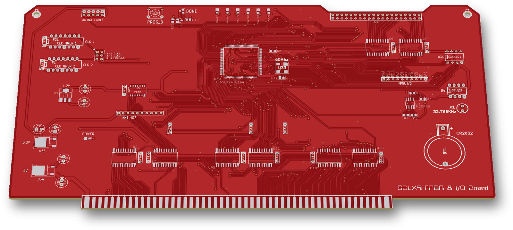
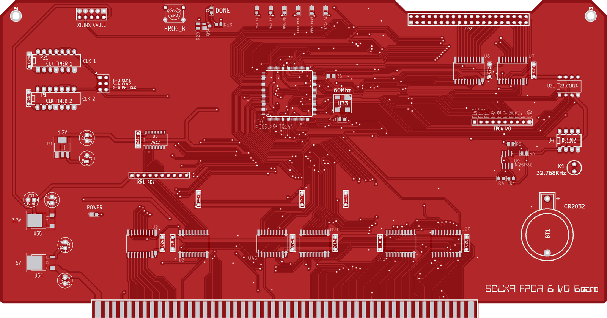
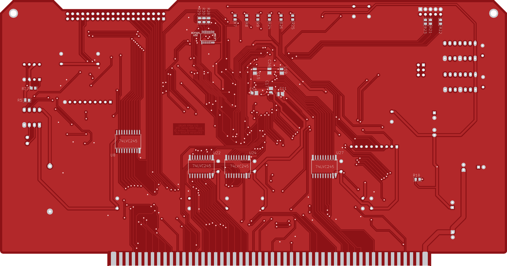

# S6LX9 FPGA & I/O Board

An S-100 I/O card built around a Xilinx Spartan-6 XC6SLX9 FPGA, with a DS1302 real-time clock and serial RAM/flash (2013–2015). The original KiCad project is `TMRINT`, in a folder called `FPGA_TIMER_INT_CONTROLLER`. The gateware in this repo is an I/O-port and DS1302 test, not a timer or interrupt controller.

 

## Status

**Built.** Gerbers (7 layers + drill) and a BOM were generated on 11 March 2014. The FPGA bitstream and PROM files were built in June 2014 and August 2015.

Silkscreen:
- top: "S6LX9 FPGA & I/O Board";
- bottom: "S6LX9 FPGA I/O / RTC Serial RAM Board / © Antony Burrows 2014 / ALL RIGHTS RESERVED".

## Hardware

| Ref | Part | Role |
|---|---|---|
| U30 | XC6SLX9-TQ144 | Spartan-6 FPGA |
| U32 | XCF02S | FPGA configuration PROM (see *Things to check*) |
| U9 | M25P80 | 8 Mbit SPI NOR flash |
| U31 | 23LC1024 | 1 Mbit SPI SRAM |
| U4 | DS1302 | Real-time clock (X1 32.768 kHz, BT1 CR2032 backup) |
| U33 | 60 MHz oscillator | FPGA clock (U30 pin 51) |
| P21, P1 | DIL14 sockets "CLK TIMER 1/2" | Oscillator sockets, selected by jumper P25 (1-2 CLK1, 3-4 CLK2, 5-6 PHI_CLK) |
| U2, U6, U7, U8, U20, U21, U22, U24, U27, U45 | 74LVC245 | 3.3 V buffers between the S-100 bus and the FPGA |
| U3, U18 | 74HC245 | Bus buffers (VI0\*/NMI\*/RESET\*/RDY outputs; DO bus) |
| U5 | 7432 | OR gate (RESET\* drive gated by the FPGA DONE signal) |
| U34 / U35 / U1 | 7805 / LM1086 / SOT-223 regulator | 5 V / 3.3 V / 1.2 V from the S-100 +8 V rail |

- **Board size:** 254.0 × 133.2 mm (10.0 × 5.0 in plus the edge-finger tab), the standard S-100 card.
- **KiCad:** Pcbnew (2013-07-07 BZR 4022)-stable; legacy `.sch`/`.brd` formats.
- **Headers and controls:** XILINX CABLE (P20, JTAG), PROG_B push-button (SW2), DONE and POWER LEDs, six FPGA LEDs labelled "FPGA P7, P8, P6, P118, P119, P1", the "FPGA I/O" test header P3 (P144 P117 P116 P92 P88 P67 P66 P75 NC GND), and a 40-pin "I/O" header P2 (internal D0–D7 plus spare I/O).
- **S-100 signals buffered to the FPGA:** A0–A23; sOUT, sINP, sMEMR, sM1, MWRT, SLAVE_CLR\*; pDBIN, pWR\*, sWO\*, CLOCK\*, PHI; VI1\*–VI7\*. Outputs through U3: VI0\*, NMI\*, RESET\*, RDY.

## How it works

The FPGA design (`fpga/U30v3.sch`, an ISE 14.7 schematic for xc6slx9-3 tqg144, pins in `fpga/pinmap.ucf`) is gate-level logic:

- **Address decode:** A7–A0 only, for ports **F0h** and **F1h**. The I/O write strobe is sOUT · pWR\*.
- **OUT F0h:** latches D0–D5 into the six FPGA LEDs (P7, P8, P6, P118, P119, P1).
  - On the board, U3 also routes P7 to **VI0\*** and P6 to **NMI\***. P8 is ORed with DONE in U5 and goes to **RESET\***.
  - So bits of port F0h also drive those S-100 lines.
- **OUT F1h:** bit-bangs the DS1302. D4 = CE/RST (pin P61), D6 = SCLK (P64), D7 = data out, and D5 = DQ tristate control (DQ on P62).
- **IN F1h:** returns the DS1302 DQ bit on D0.
- **Bus buffers:**
  - `DBUSIN` (P2) enables U18 on the S-100 DO lines when F0h/F1h is addressed.
  - `DBUSOUT` (P5) enables U20 on the DI lines during an IN from F1h.
  - `U8DIR` (P74) controls the internal data buffer U8.
- **Other outputs:** CLK1 (P85, from the CLK_SEL jumper) ÷ 16 appears on P144. Write strobes and bus signals go to the P3 test header.
- **Reset:** SLAVE_CLR\* (P97) clears all latches.
- **Not used by the gateware:** the 23LC1024, M25P80 and 60 MHz oscillator.

Gateware versions:
- `U30v1.sch` (2014-06): F0h LEDs only.
- `U30v2.sch` (2015-08-01): the buffer enable is also qualified by pWR\*.
- `U30v3.sch` (2015-08-08): adds the DS1302 port at F1h. This is the version the project builds.

## Files

| Path | What |
|---|---|
| `TMRINT.sch`, `TMRINT-cache.lib` | KiCad schematic and its symbol cache |
| `TMRINT.brd` | KiCad PCB |
| `TMRINT.net`, `TMRINT.cmp`, `TMRINT.pro` | Netlist, component/footprint list, project file |
| `GERBERS/` | Fabrication gerbers and drill file |
| `BOM/TMRINT.csv` | Bill of materials |
| `fpga/U30v1.sch`, `U30v2.sch`, `U30v3.sch` | Xilinx ISE schematics for U30 |
| `fpga/pinmap.ucf` | U30 pin constraints |
| `fpga/TIMER_INT1/TIMER_INT1.xise` | ISE 14.7 project (top `U30v3`; sources referenced as `../U30v3.sch`, `../pinmap.ucf`) |
| `fpga/u30v3.bit` | Final bitstream |
| `fpga/U30v3.prm` | PROM map with the `promgen` command used to make the PROM image |

## History

The git history replays the original dated backups of the KiCad project and the ISE project, from November 2013 to August 2015.

## Things to check (TODO)

- **U18, U20 and U8:**
  - They are drawn as 74HC245/74LVC245 (BOM too), but each has DIR (pin 1) tied to /OE (pin 19), which is the wiring for a 74x541.
  - Check which way data passes (U18: S-100 DO ↔ internal D; U20: internal D ↔ S-100 DI; U8: internal D ↔ FPGA) against the part actually fitted.
  - U18 was a 74LS541 in the schematic until November 2013, and the UCF comments still say "541".
- **Configuration PROM:** U32 is an XCF02S in the schematic and BOM. `fpga/U30v3.prm` was generated for an XCF04S, and the XC6SLX9 bitstream (about 2.7 Mbit) is larger than an XCF02S holds.
- **IN F1h:** check the polarity of the D0 IOBUF tristate control in `U30v3.sch`. As drawn, it is the inverse of `DBUSOUT`, which tristates D0 during the read.

## Credits

The board and gateware are original work. Some KiCad symbols come from community libraries listed in the schematic header (N8VEM and others).

## License

Hardware: CERN-OHL-S-2.0 for the original work in this folder; see the repo NOTICE for third-party parts.
