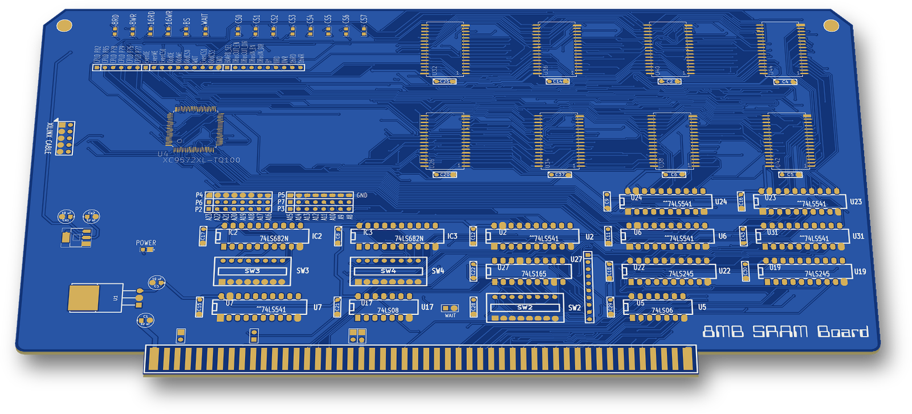
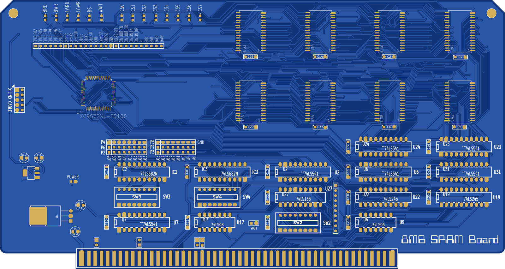
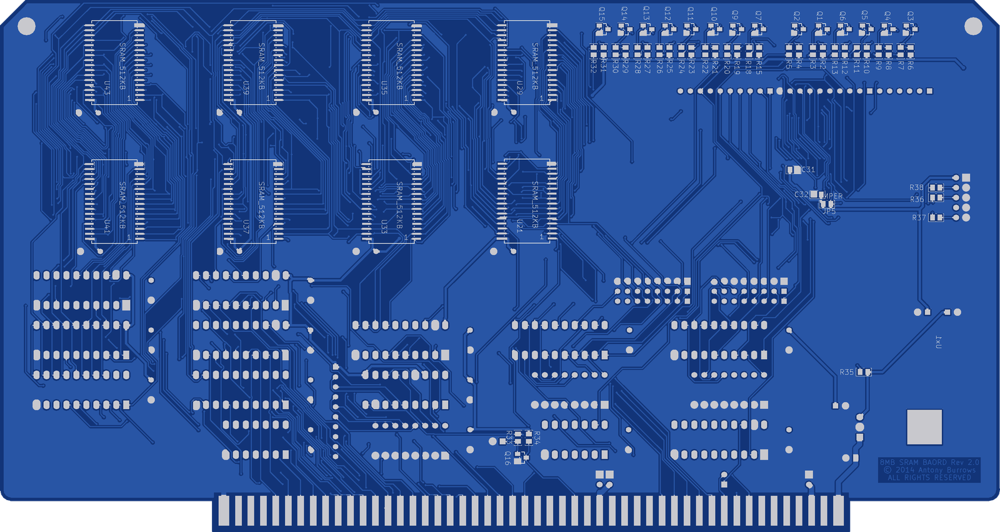
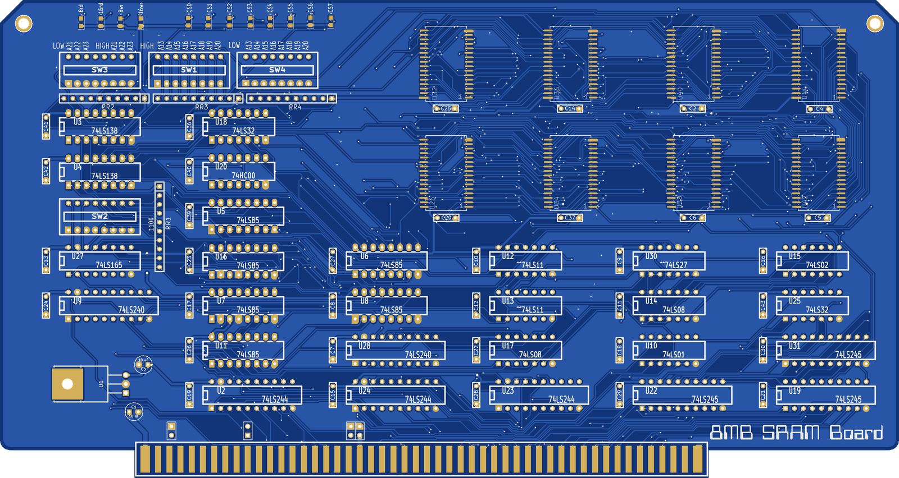

# 8MB SRAM Board

An S-100 static RAM card holding 8 MB as 16 × 512 KB SRAMs in a 16-bit even/odd byte array. Silkscreen: "8MB SRAM BAORD" (rev1) and "8MB SRAM BAORD Rev 2.0" (rev2), 2014–2015.

 

Rev1 (discrete TTL):

## Status
Both revisions were built. Fabrication gerbers are in `rev1/GERBERS` (2014-03-24) and `rev2/GERBERS` (2014-04-16).

## Hardware
**Rev2** (`rev2/`):

| Ref | Part | Role |
|---|---|---|
| U4 | XC9572XL-TQ100 | CPLD: board select, 8/16-bit strobes, bank decode, bus-buffer control |
| U26 U32 U34 U36 U38 U40 U42 U44 | SRAM 512K × 8 (SOP32) | even byte bank (ED0–7) |
| U21 U29 U33 U35 U37 U39 U41 U43 | SRAM 512K × 8 (SOP32) | odd byte bank (OD0–7) |
| IC2, IC3 | 74LS682 | board-address compare against SW3 / SW4 |
| U2 U6 U7 U23 U24 | 74LS541 | address and status buffers |
| U31 | 74LS541 | even-to-odd byte bridge for 8-bit transfers |
| U22 / U19 | 74LS245 | data in from DO0–7 / data out to DI0–7 |
| U27 | 74LS165 | wait-state generator, pattern set by SW2 |
| U17 / U5 | 74LS08 / 74LS06 | BOARD_SYNC gate / PHI inverter |
| Q16 | BC817 | open-collector drive of RDY (bus pin 72) |
| Q1–Q15 | BC817 | LED drivers |
| U1, Ux1 | 7805, 3.3 V SOT-223 | 5 V and 3.3 V regulators |
| P9 | 2×5 header | Xilinx JTAG cable |

**Rev1** (`rev1/`): the same 16 SRAMs, with the logic in TTL:
- U5 U6 U7 U8 U11 U16: 74LS85 address-range comparators with DIP switches SW1, SW3, SW4;
- U3, U4: 74LS138 bank decode;
- U27: 74LS165 wait generator with SW2, driving RDY through a 74LS01;
- U2 U23 U24: 74LS244, U9 U28: 74LS240 and U19 U22 U31: 74LS245 for the bus.

**Board size:** 254.0 × 134.9 mm (Edge.Cuts extents, including the edge-connector tab).

**Made with:** KiCad (2013-07-07 BZR 4022)-stable; Xilinx ISE 14.7 for the CPLD.

**Switches, jumpers and LEDs:**
- **Rev2:**
  - SW3/SW4: board address. SW2: wait states.
  - JP4 "WAIT": disables wait states. JP8: SIXTN*. JP1/JP2/JP3: bus 0V pins 20/53/70 to GND.
  - Headers P2/P3 (address rows A23–A16 and A15–A8), P4/P5 (GND rows) and P6/P7 (comparator inputs) pick which address lines are compared.
  - Test headers P8, P10, P11.
  - LEDs: `8RD 8WR 16RD 16WR BS WAIT CS0–CS7`, plus POWER.
- **Rev1:**
  - DIP switches labelled `LOW A21 A22 A23 / HIGH A21 A22 A23` (SW3), `HIGH A13…A20` (SW1) and `LOW A13…A20` (SW4).
  - LEDs: `8rd 16rd 8wr 16wr CS0–CS7`.

## How it works
- **Banking:** every SRAM gets address lines A1–A19, and A0 picks the even or odd byte ("EVEN BYTE RAM" / "ODD BYTE RAM" in the schematic). One even plus one odd chip is a 1 MB 16-bit bank. A20–A22 pick one of 8 banks; the `CS0`–`CS7` LEDs show which.
- **16-bit transfers** (sXTRQ*, bus pin 58, low): the even byte arrives on DO0–7 and the odd byte leaves on DI0–7, both banks enabled.
- **8-bit transfers:** only the bank matching A0 is enabled. The U31 bridge (`B*`) copies the byte across for an 8-bit read at an even address or an 8-bit write at an odd address.
- **Board address, rev1:** two 74LS85 chains compare A23–A13 against a LOW start address and a HIGH end address set on the DIP switches.
- **Board address, rev2:** IC2/IC3 (74LS682) compare up to 16 address bits (A23–A8) against SW3/SW4. A shunt on P6/P7 connects each comparator input either to its address line or to GND.
- **CPLD (U4, `cpld/U4v1.sch`, `cpld/pinmap.ucf`):**
  - `BS` = a memory read (pDBIN) or write (pWR*) that is not an I/O or interrupt cycle (sINP, sOUT, sINTA) while both comparators report equal.
  - From BS it makes `RD8/WR8/RD16/WR16`, the even/odd OE and WE strobes, the per-bank chip selects (A20–A22 through 74x138 decoders), the bridge enable `B*`, and the U19/U22 buffer enables.
- **Wait states:** done in TTL, not in the CPLD. `BOARD_SYNC` (BS AND pSYNC) loads U27 (74LS165) from SW2, PHI* shifts it, and its output pulls RDY low through Q16.
- **UCF note:** the header of `pinmap.ucf` says "U5", but the CPLD is U4 on the board. All 57 pin assignments match the nets of U4.

## Revisions
| Folder | Silkscreen | Dates |
|---|---|---|
| `rev1/` | 8MB SRAM BAORD | 2014-03-20 → 2014-04-07 |
| `rev2/` | 8MB SRAM BAORD Rev 2.0 | 2014-04-11 → 2015-07-17 |
| `cpld/` | U4 on rev2 | 2014-05-02 → 2015-12-25 |

## Files
- `rev1/`:
  - KiCad schematic, board, netlist and `-cache.lib`;
  - `GERBERS/`;
  - `BOM/` (csv, xlsx);
  - `other/`: board logo artwork and its footprint `LOGO8MBSRAM3.kicad_mod`.
- `rev2/`: KiCad schematic, board, netlist, `-cache.lib`, `GERBERS/`.
- `cpld/`:
  - `U4v1.sch`: ISE schematic;
  - `pinmap.ucf`: pin map;
  - `SRAM_B_V2/SRAM_B_V2.xise`: ISE project;
  - `SRAM_B_V2/U4v1.jed`: programming file for XC9572XL-7-TQ100.

Left out: KiCad backups and router files, PDFs and ISE build output.

## History
The git history replays the original dated backups of this board, 2014-03-20 to 2015-12-25.

## Things to check (TODO)
- In `cpld/U4v1.sch` the bank-decoder outputs for banks 6 and 7 are unconnected, so the final JED never drives `EVENRAM_CS6/7` or `ODDRAM_CS6/7` (pins P64, P74, P50).
- In the final fit, `CS2_LED` is placed on P65. `pinmap.ucf` assigns P65 to `EVENRAM_CS7`, and the rev2 board routes it to U44 pin 22 (`EvenRAMCS7*`).
- On the rev2 board, the `CS2_LED` net goes only to R22; it is not wired to a CPLD pin.

## Credits
- **John Monahan, S-100 16MB SRAM board V01** (S100Computers.com, with N8VEM): the rev1 bus logic follows this board's design. The evidence:
  - the even/odd data buses `ED0–7`/`OD0–7`;
  - the `8rd 8wr 16rd 16wr` strobes;
  - `BOARD_SYNC` and `buffered_A0`;
  - the 74LS165 wait-state generator;
  - the same bus-buffer set.

  The SRAM array, address compare, bank decode, PCB layout and the rev2 CPLD design are original to this board.
- **Schematic symbols:** the N8VEM KiCad libraries.

## License
Hardware: CERN-OHL-S-2.0 for the original work in this folder; see the repo NOTICE for third-party parts. The "© 2014 Antony Burrows / ALL RIGHTS RESERVED" copper text is left as fabricated; the license above applies.
