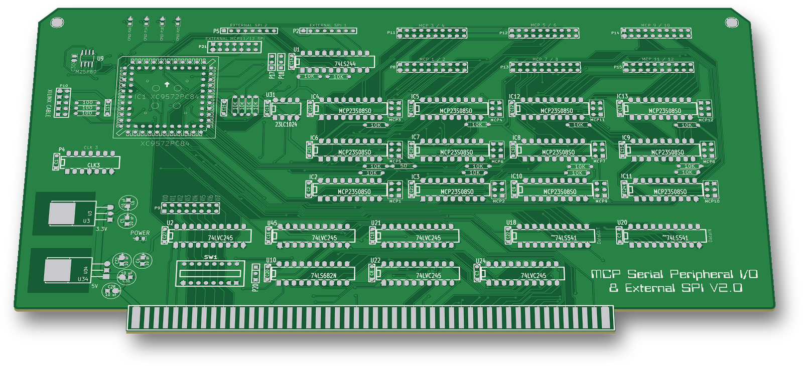
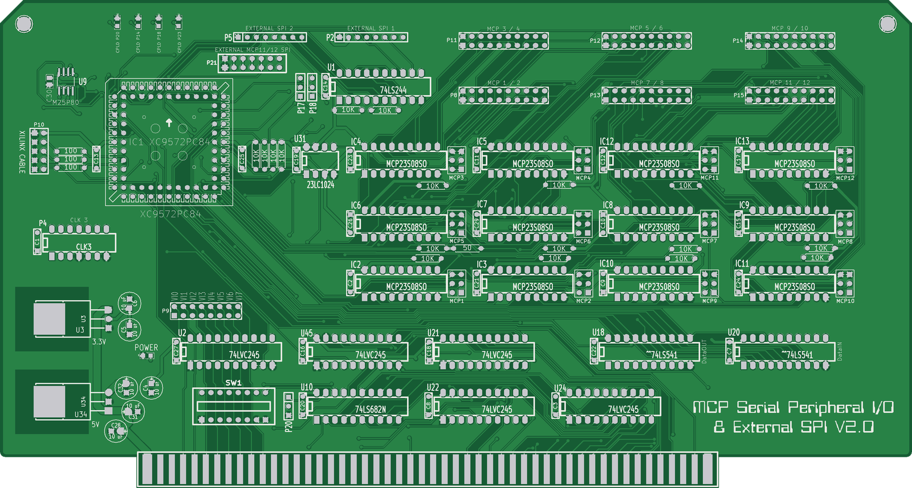
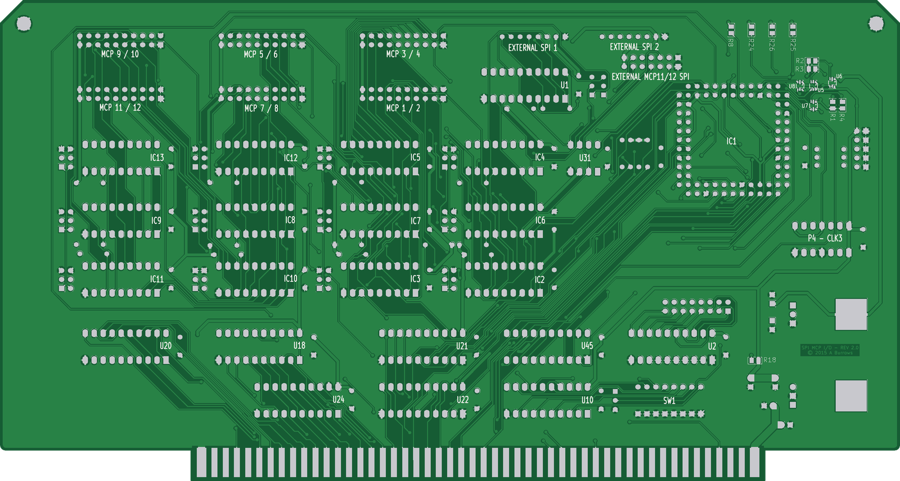

# MCP Serial Peripheral I/O & External SPI V2.0

An S-100 I/O board from 2015. An XC9572 CPLD drives twelve MCP23S08 SPI port expanders, giving 96 I/O lines, plus two external SPI ports.

 

The renders come from the fabrication gerbers dated 29-07-2015.

## Status
Built. The gerbers in `GERBERS/` are dated 29-07-2015 and carry "SPI MCP I/O - REV 2.0 © 2015 A Burrows" in bottom copper.

The KiCad files hold a later revision (schematic 13-08-2015) that was not plotted to gerbers. It adds a second 74LS682 (U11), a 12-way SW1 and the VI0\* line on the vector jumper, and U9 moves to a DIP-8 footprint.

No CPLD project for this board survives in the backups.

## Hardware

| Ref | Part | Role |
|---|---|---|
| IC1 | XC9572 PC84 (PLCC-84 socket) | S-100 decode and SPI master |
| IC2–IC13 | MCP23S08 (DIP-18) | 12 × 8-bit SPI port expanders ("MCP1"–"MCP12") |
| U31 | 23LC1024 | SPI SRAM on the shared SPI bus |
| U9 | M25P80 | SPI flash, 3.3 V |
| U5–U8 | 74LVC1T45 | 5 V ↔ 3.3 V level shifting for U9 |
| U1 | 74LS244 | buffers for EXTERNAL SPI 1 and 2 |
| U21, U22, U24, U45 | 74LVC245 | S-100 address, status and control inputs |
| U2 | 74LVC245 | interrupt-vector driver to the P9 jumper |
| U18, U20 | 74LS541 | S-100 data out → CPLD, CPLD → data in |
| U10, U11 | 74LS682 | I/O address compare against SW1 (U11 in the later revision only) |
| U34 / U3 | 7805 / LM1086 | 5 V and 3.3 V from the S-100 +8 V |
| P4 | "CLK 3" DIP-14 oscillator | CPLD clock GCK2 |

- Board size: 254.0 × 135.6 mm (10.0 × 5.34 in, including the edge fingers).
- KiCad (2013-07-07 BZR 4022)-stable, legacy `.sch`/`.brd`.
- Jumpers and switches:
  - MCP1–MCP12: address jumpers, A0/A1 for each MCP23S08.
  - P17 "INT3" and P18 "INT4": interrupt source select.
  - P20: 8-bit or 16-bit I/O decode.
  - P9 "VI0…VI7": interrupt-vector select.
  - SW1: I/O address.
- Connectors:
  - P8, P11–P15 "MCP 1 / 2" … "MCP 11 / 12": port headers.
  - P2 "EXTERNAL SPI 1", P5 "EXTERNAL SPI 2" and P21 "EXTERNAL MCP11/12 SPI".
  - P10 "XILINX CABLE": JTAG.
- LEDs: "CPLD P14/P18/P20/P23" and "POWER".

## How it works
- **SPI bus:** the CPLD is the master. SCK is on P65, MOSI on P62 and MISO on P66, each with a 10 K pull-up. Every expander has its own chip select:

  | Device | CPLD pin |
  |---|---|
  | MCP1 | P83 |
  | MCP2 | P84 |
  | MCP3 | P44 |
  | MCP4 | P52 |
  | MCP5 | P54 |
  | MCP6 | P55 |
  | MCP7 | P48 |
  | MCP8 | P50 |
  | MCP9 | P57 |
  | MCP10 | P53 |
  | MCP11 | P58 |
  | MCP12 | P61 |
  | 23LC1024 | P56 |

  The CPLD drives `BOARD_RESET*` (P31) to all expanders and to the external headers.
- **Ports:** each 2×10 header carries two expanders. The odd pins 3–17 are GP0–7 of the first expander, the even pins 4–18 are GP0–7 of the second, pins 1–2 are GND and pins 19–20 are VCC.
- **Interrupts:**
  - MCP1 INT goes to P82 and MCP2 INT to P46.
  - Jumper P17 picks MCP3 or EXTERNAL SPI 1 for P51.
  - Jumper P18 picks MCP4 or EXTERNAL SPI 2 for P47.
- **External SPI:** P2 and P5 are 8-pin headers (GND, VCC, RESET\*, INT, SO, SI, CLK, CS) buffered by U1.
  - SPI 1: enable P11, CS P2.
  - SPI 2: enable P13, CS P3.

  P21 brings out the bus with the MCP11 and MCP12 chip selects.
- **SPI flash:** the M25P80 has its own 3.3 V SPI through the 74LVC1T45s: SI P4, SCK P1, CS P6, SO P7.
- **S-100 decode:** A0–A4 go to the CPLD. U10 compares A8–A15 with SW1, and P20 selects 16-bit or 8-bit I/O decode.
  - Later revision: U11 compares A5–A7 with SW1 and gives the board select on P70.
  - Gerber revision: the CPLD reads A5–A7 itself.
- **Bus signals:** data out comes in through U18 and data in goes out through U20, both on shared CPLD pins. The status and control lines (sOUT, sINP, sMEMR, MWRT, pWR\*, pDBIN, sWO\*, RESET\*, SLAVE_CLR\*) come in through the 74LVC245s. PHI and CLOCK feed GCK0 and GCK1.
- **Vector interrupt:** the CPLD drives P15 into U2, and jumper P9 routes it to one of VI0\*–VI7\*.

## Files
| Path | Contents |
|---|---|
| `XC9500v1.sch`, `XC9500v1-cache.lib` | schematic and its symbol cache |
| `XC9500v1.brd` | PCB layout |
| `XC9500v1.net`, `XC9500v1.cmp`, `XC9500v1.pro` | netlist, footprint assignments, project |
| `XC9500v1.csv`, `XC9500v1.xlsx` | BOM from July 2015 (matches the gerber revision: 8-way SW1, 7×2 P9) |
| `GERBERS/` | REV 2.0 gerbers and drill file, 29-07-2015 |
| `logo/` | title logo art and its KiCad footprint |

## History
The git history replays the original dated backups, 25-07-2015 to 14-12-2015.

## Things to check (TODO)
- U31 23LC1024: pin 5 (SI) is on the SCK net (P65) and pin 6 (SCK) is on the MOSI net (P62). Check this against the MCP23S08 bus wiring.
- U2 (interrupt-vector buffer): DIR is tied to GND (B → A). Check the direction against the intended CPLD → VI0\*–VI7\* path.

## Credits
- The S-100 edge-connector symbol (`S100_MALE`) is from the N8VEM KiCad library.
- Other symbols come from community Xilinx and Microchip KiCad libraries and the author's own library.

## License
Hardware: CERN-OHL-S-2.0 for the original work in this folder; see the repo NOTICE for third-party parts.
