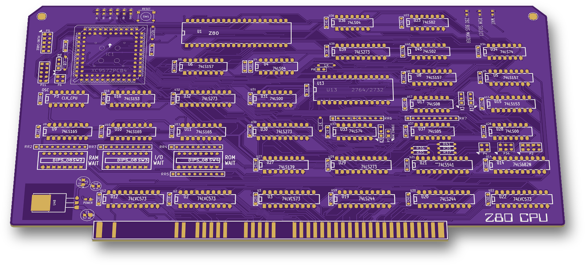
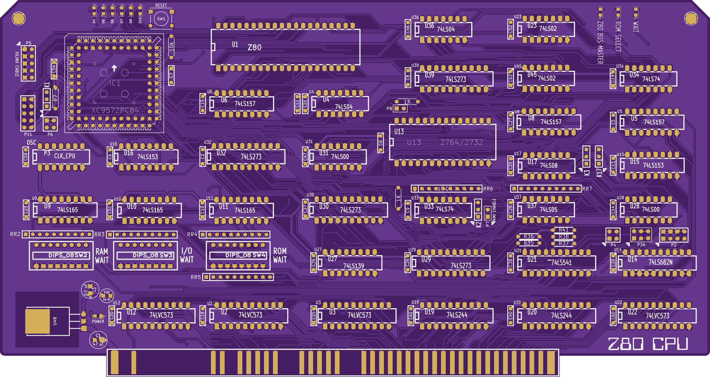
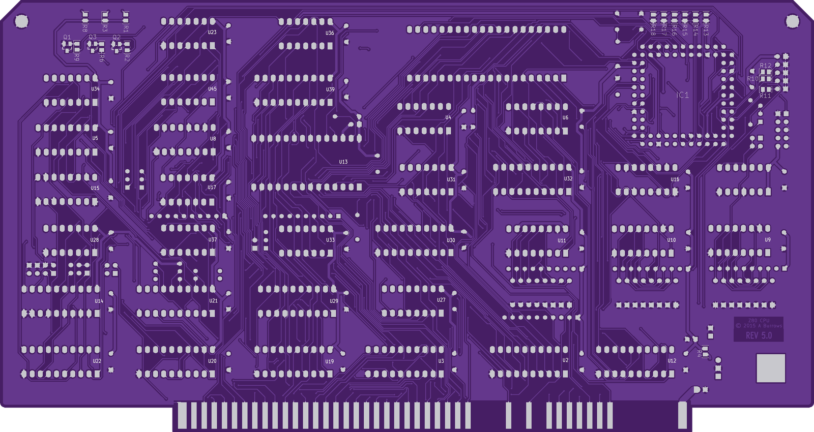
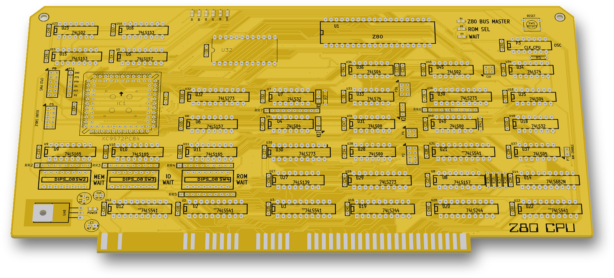

# Z80 CPU

An S-100 bus-master CPU card built around a Zilog Z80, in four revisions (silkscreen REV 1.0 to REV 5.0), 2014–2016. From REV 4.0 on, most of the bus control logic is in a Xilinx XC9572 CPLD.

 

## Status
All four revisions were built: v2 (REV 1.0), v3 (REV 2.0), v4 (REV 4.0) and v5 (REV 5.0).
The v4 gerbers are in a folder named `SENT to PCBway 28-07-2015`.

## Revisions
| Folder | Silkscreen | Main change | Design dates |
|---|---|---|---|
| `v2/` | "Z80 CPU BOARD", REV 1.0 | First board, all TTL, 2732 ROM. Files keep the `s100_Z80 V2` name of the S100Computers "VERSION 02" design they started from | Jun 2014 (schematic notes to Aug 2015) |
| `v3/` | "Z80 CPU" logo, REV 2.0 | Re-layout, master oscillator and CLK DIVISION jumpers, pSYNC DIP switch | Jul–Aug 2014 |
| `v4/` | "Z80 CPU - REV 4.0 © 2015 A Burrows" | XC9572 PC84 CPLD (IC1) takes over the S-100 status/control logic, Xilinx JTAG header, CPLD I/O headers | Jun–Jul 2015 (schematic updated Dec 2015) |
| `v5/` | "Z80 CPU © 2015 A Burrows", REV 5.0 | 2764 ROM (2732 still fits), 74LVC573 latches instead of 74LS541 buffers, CPLD wired to the data bus, ROM LOCK and CLK SEL jumpers | Dec 2015–Jan 2016 (board edit Oct 2016) |

There is no REV 3.0.

 

Left: REV 4.0 (`v4/`). Right: REV 5.0 (`v5/`).

## Hardware (v5)
| Ref | Part | Role |
|---|---|---|
| U1 | Z80 (40-DIP) | CPU |
| IC1 | Xilinx XC9572, PC84 (PLCC socket) | Bus status/control, reset, wait and ROM-enable logic |
| U13 | 2764 EPROM (2732 also fits, silkscreen "2764/2732") | On-board ROM |
| U2, U3, U12, U22 | 74LVC573 | Address and status latches to the S-100 bus (v4: 74LS541 buffers) |
| U19, U20 | 74LS244 | Data bus buffers |
| U29, U30, U32, U39 | 74LS273 | Latches/ports |
| U21 | 74LS541 | Clock and control buffers to the bus |
| U9, U10, U11 | 74LS165 | Wait-state shift registers, loaded from DIP switches SW2–SW4 |
| U14 | 74LS682 | 8-bit comparator |
| P3 | DIL14 oscillator ("CLK_CPU", "OSC") | CPU clock source |
| U48 | 7805 LDO | 5 V regulator |

- **Board:** 254.0 x 134.6 mm (10.0 x 5.3 in), two layers, the same outline on all revisions.
- **Switches and jumpers (v5):** DIP switches "RAM WAIT", "I/O WAIT" and "ROM WAIT". SW1 "RESET". K1 "ROM LOCK". P6 "CLK SEL". P7 "NMI ENABLE". P5 "XILINX CABLE" (JTAG). P11 is the CPLD I/O header.
- **LEDs (v5):** "Z80 BUS MASTER", "ROM SELECT", "WAIT", "POWER", and D4–D7, D9, D10 driven from the CPLD.
- **Tools:** KiCad (pcbnew 2013-07-07 BZR 4022-stable) and Xilinx ISE 14.7.

## How it works
- The Z80 drives the S-100 bus as bus master. CPU control lines (M1\*, RD\*, WR\*, MREQ\*, IORQ\*, REFSH\*) go into the CPLD. The CPLD produces the S-100 status and control signals:

  | Signal | S-100 pin |
  |---|---|
  | sINP | 46 |
  | sOUT | 45 |
  | sMEMR | 47 |
  | MWRT | 68 |
  | sWO\* | 97 |
  | sINTA | 96 |
  | pSYNC | 76 |
  | pWR\* | 77 |

  Pin numbers are from the UCF comments. On v4, sINP leaves through U22 to pin 46 and sWO\* to pin 97.
- The CPLD handles reset: the RESET button and slave clear go in, and the Z80 RESET\* comes out on CPLD P17.
- Wait states come from three DIP switches through 74LS165 shift registers. The CPLD gates the wait signal (WAITen, pin 25 on v4).
- The on-board ROM is enabled through the CPLD. Its enable line is called RomEn (CPLD P37) and its address-range input RomAddr (P45).
- In the v4 pin map, four CPLD LEDs (D4–D7) sit on P39, P40, P41 and P81. Port D0/D1 bit 7 are inputs.
- v2 and v3 have no CPLD; the same functions are built from 74LS/74S gates.

## CPLD (`cpld/`)
Two Xilinx ISE projects for the XC9572 PC84. Both pin maps are for the v4 board:
- `cpld/Z80_Board_V4/`: the first design. Top schematic `IC1v1.sch`, PISO shift-register sub-sheet `test1.sch` (also referenced by the project as `V4board-t2/PISO.sch`), `pinmap.ucf`, `IC1v1.jed`. Speed grade -10, July 2015.
- `cpld/z80v42/`: the second design. Revisions `IC1v2.sch`, then `IC1v2_2` to `IC1v2_7.sch`. The project top is `IC1v2_7`, with `IC1v2pinmap.ucf` and `IC1v2_7.jed`. Speed grade -7, Aug–Dec 2015. The pin map header reads "PIN MAP OF IC1 on Z80 Board V4". It uses CPLD pins that the v4 schematic notes as wire modifications ("Modification: tied to CPLD P37", "tied to CPLD P45 …").

## Files
| Path | Contents |
|---|---|
| `v2/`, `v3/`, `v4/`, `v5/` | KiCad project per revision: `.sch` and `-cache.lib` (schematic with its symbols), `.kicad_pcb`, `.net`, `.cmp`, `.pro` |
| `v2/board.*` | v2 board files (the v2 PCB was named `board`) |
| `v2/`, `v4/` `*.csv`, `*.xlsx` | IC parts lists |
| `v*/GERBERS/` | Fabrication gerbers and drill file for each revision |
| `v5/logo/` | "Z80 CPU" logo bitmap and its KiCad footprint |
| `v2/Logisim circuits/1.circ` | Small Logisim sketch (A14, A15, IOREQ, S0, S1 decode) |
| `cpld/` | ISE schematics, pin maps, project files and final JEDEC files |

## History
The git history replays the original dated backups of all four revisions and the two CPLD projects, from June 2014 to October 2016.

## Things to check (TODO)
- **CPLD design for v5:** both CPLD projects target the v4 board with wire modifications. The v5 board connects IC1 differently in places. For example, P45 (RomAddr in the pin map) is on data bus D4, and P76 (Resbut in the pin map) goes to the U22 latch enable. A CPLD design for the v5 pinout is not in this folder.
- **v3 gerbers:** they are dated 2014-07-18. The v3 schematic and board were changed after that, up to 2014-08-09, so the gerbers don't match the final `v3/s100_Z80 V3.kicad_pcb`.
- **v5 board file vs gerbers:** `v5/s100_Z80 V5.kicad_pcb` was saved in Oct 2016, after the Jan 2016 gerbers. It has wider CLK_OSC traces and the bottom text "© 2016" (the gerbers say "© 2015").
- **v5 drill file:** `v5/GERBERS/s100_Z80 V5.drl` is about 21 hours older than the copper gerbers.
- **v4 drill file:** `v4/GERBERS/s100_Z80 V4.drl` is an RS-274X file exported from gerbv, not Excellon.

## Credits
- **Origin:** this board started from John Monahan's **S-100 Z80 CPU Board V2** ([S100Computers.com](http://www.s100computers.com)). Full credit to him for the original design.
  - The v2 files keep its `s100_Z80 V2` name, and the first v2 board file still carried its text "S-100 Z80 CPU BOARD VERSION 02".
  - All four schematics share component time stamps with the original.
  - The original files are not included here.
- **Libraries:** schematic symbols from the N8VEM KiCad libraries (`N8VEM-KiCAD`, `00N8VEM`; e.g. the S-100 edge connector), embedded in the `-cache.lib` files.

## License
Hardware: CERN-OHL-S-2.0 for the original work in this folder; see the repo NOTICE for third-party parts. Images and documentation: CC-BY-4.0.
