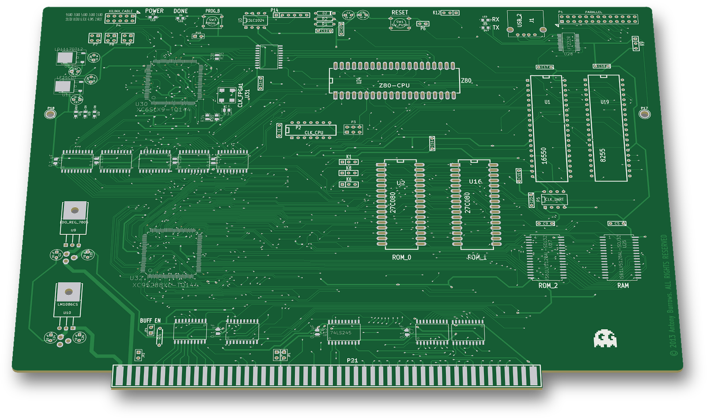
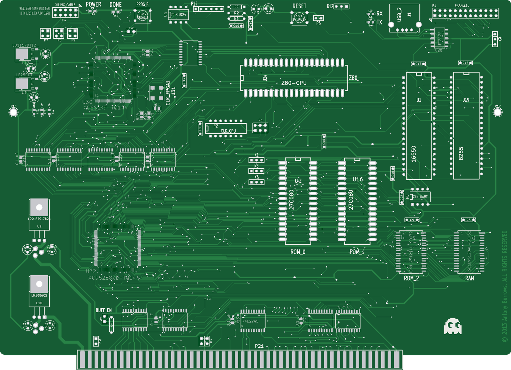
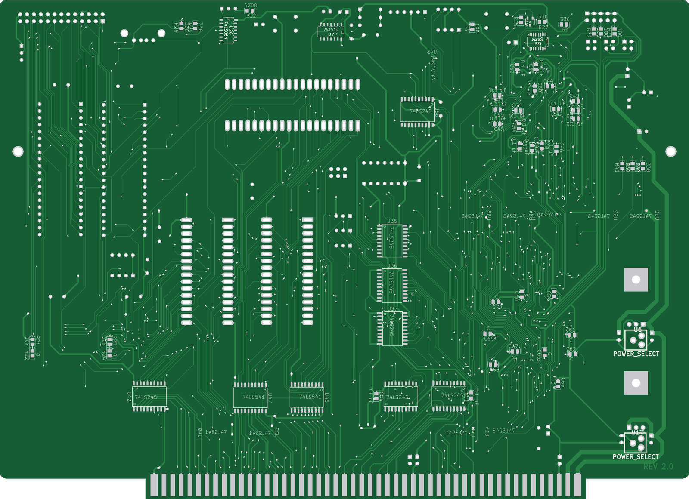

# Z80 FPGA SBC

An S-100 Z80 single-board computer with an XC95288XL CPLD, a Spartan-6 XC6SLX9 FPGA, SRAM, EPROM, a 16550 UART on USB and an 8255 parallel port (2013).

 

## Status
Not built. REV 1.0 was plotted to gerbers (2013-07-22). REV 2.0 exists as a KiCad layout only.

## Hardware (REV 2.0)
| Ref | Part | Role |
|---|---|---|
| U24 | Z80 (DIP-40) | CPU |
| U32 | XC95288XL-TQ144 | CPLD: Z80 address/control decode, S-100 buffer enables |
| U30 | XC6SLX9-TQ144 | Spartan-6 FPGA |
| U33 | XCF02S | FPGA configuration PROM |
| U31 | oscillator (CLK_FPGA1) | FPGA clock |
| U2, U16 | 27C080 | EPROM sockets "ROM_0", "ROM_1" |
| U25, U27 | IS61LV5128AL (512K×8) | SRAM "RAM" and "ROM_2" |
| U3 | 23LC1024 | SPI SRAM on the FPGA |
| U1 | 16550 | UART |
| U28, J1 | FT232R, USB | USB serial for the 16550 |
| U19 | 8255 | parallel I/O on P1 "PARALLEL" |
| U13–U15, U35–U37, U42, U44, U50–U52, U54, U55 | 74LS245 | S-100 bus buffers |
| U22, U46–U49 | 74LS541 | S-100 address and data buffers |
| U43, U53 | 74LVC245 | 3.3 V / 5 V buffers |
| U9, U10, U11, U12 | 7805, LM1086CS, LF25CDT, LD1117DT12 | regulators (7805 and LM1086 fed from the S-100 +8 V) |
| U6, U17 | POWER_SELECT | 3-pin supply selects: U6 joins the 7805 output or +16 V to the 5 V rail; U17 joins the LM1086 output or −16 V to the 3.3 V rail |

- Board size: 254.0 × 183.9 mm (10.00 × 7.24 in) including the 0.30 in edge fingers, with 2 copper layers.
- KiCad: Pcbnew/Eeschema (2013-07-07 BZR 4022)-stable for REV 2.0, and PCBNEW (2011-07-08 BZR 3044)-stable for REV 1.0 and its gerbers.
- Switches: SW1 RESET, SW3 PROG_B (FPGA).
- LEDs: POWER, DONE, RX, TX.
- Jumpers:
  - JP1–JP3 connect S-100 pins 20, 53 and 70 to GND.
  - JP4 "BUFF EN" enables the S-100 buffers.
  - P3 CLK_SEL picks the CPU clock source.
- Clock sockets: P2 CLK_CPU, P5 CLK_UART.
- JTAG: P4 XILINX_CABLE, plus P7 CPLD_JTAG, P8 PF_JTAG and P9 S6_JTAG.

## How it works
- The Z80 runs from on-board EPROM and SRAM. The CPLD (U32) sees the whole Z80 address bus (A0–A7 on pins 100–107, A8–A15 on pins 79–87) and /M1, /MREQ, /IORQ, /RD, /WR (pins 28–33) and /RESET (pin 131).
- The CPLD drives the S-100 data buffer enables: /DBUSIN_EN (pin 132, U22) and /DBUSOUT_EN (pin 133, U49).
- S-100 address A0–A18 goes out through 74LS541s U46–U48. Data goes out through U22 and comes in through U49. Status and control lines (sM1, sOUT, sINP, sMEMR, pSYNC, pWR*, pDBIN, sINTA, sWO*, RDY, INT*, HOLD*, RESET*, PHI) go through 74LS245s.
- The 16550 (U1) talks to the FT232R (U28): FT232R TXD → 16550 SIN, and 16550 SOUT → FT232R RXD.
- The FPGA (U30) boots from the XCF02S and has a 23LC1024 SPI SRAM (U3) on pins 40, 41, 43 and 44, also brought out on header P14.
- No CPLD or FPGA design files for this board were kept.

## Revisions
| Folder | Layout text | Dates | Notes |
|---|---|---|---|
| `rev1.0/` | REV 1.0 | 2013-07-22 | Extra XC9572XL-VQ44 "CPLD2" (U8) for S-100 control, 14× MAX3002 level translators, MAX232, 6× LT3081 regulators. 10.00 × 6.91 in. |
| top level | REV 2.0 | 2013-08-26 → 2013-09-13 | Re-layout: U8, the MAX3002s, the MAX232 and the LT3081s replaced by 74LS245/74LS541/74LVC245 buffers and fixed regulators. |

## Files
- `SBC.sch`, `SBC-cache.lib`: schematic, KiCad legacy format. Newer KiCad needs *Remap Symbols* with the cache lib.
- `SBC.brd`: REV 2.0 layout.
- `SBC.pro`, `SBC.net`, `SBC.cmp`: project, netlist and footprint assignments.
- `BOM/SBC.csv`: bill of materials, exported 2013-08-12 (REV 1.0 era).
- `rev1.0/SBC_rev1.0.brd`: REV 1.0 layout, saved by KiCad as `SBC.000` and renamed so it opens as a `.brd`.
- `rev1.0/gerbers/`: REV 1.0 gerbers and drill file.

## History
The git history replays the original dated backups and working folder (2013-07-22 to 2013-09-13).

## Things to check (TODO)
- S-100 pins 59 and 63 are named CLOCK2 and IOREQb in this board's connector symbol, and 59 is driven by a 74LS245 (U15). IEEE-696 assigns 59/61–64 to A19–A23. Check this against the bus pinout before using the board with 24-bit address cards.
- CPLD U32 pins 9 and 17 are both on /D0, and pins 10 and 19 are both on /D1. Confirm this is intended.
- The cached XC95288XL symbol defines pins 50–54 and 56–59 four times each (stacked).
- In `SBC.net`, 74LVC245 U53 has no net on pin 1 (DIR) or pin 19 (/OE), and U43 has no net on pin 19 (/OE). Check before fitting.
- POWER_SELECT U17 has pins on −16 V (S-100 pin 52), the LM1086 output and the 3.3 V rail, and U6 has pins on +16 V, the 7805 output and the 5 V rail. Check the intended part or link for each before power-up.

## Credits
- The schematic was started from the **N8VEM SBC V2** (ECB SBC V2) KiCad design by **Andrew Lynch / the N8VEM project**.
  - The Z80, 16550, 8255, 27C080, 74LS14/74LS06, parallel port, reset and jumper parts keep the original KiCad timestamps (2008–2010).
  - The schematic uses the N8VEM KiCad symbol libraries.
- The S-100 edge-connector symbol comes from the S100Computers (John Monahan) Z80 V2 KiCad files.

## License
Hardware: CERN-OHL-S-2.0 for the original work in this folder; see the repo NOTICE for third-party parts (N8VEM). The board copper carries the text "© 2013 Antony Burrows. ALL RIGHTS RESERVED". It is left as designed. The licence above applies to the files in this repo.
