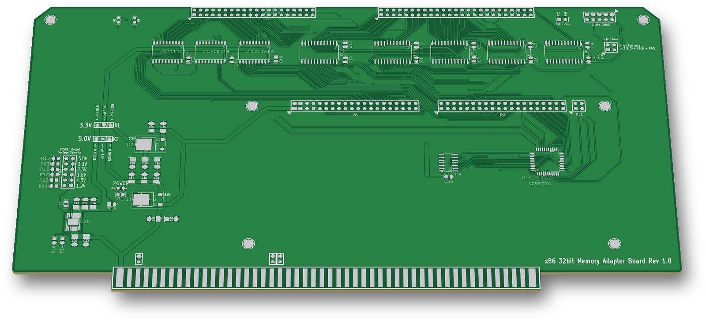
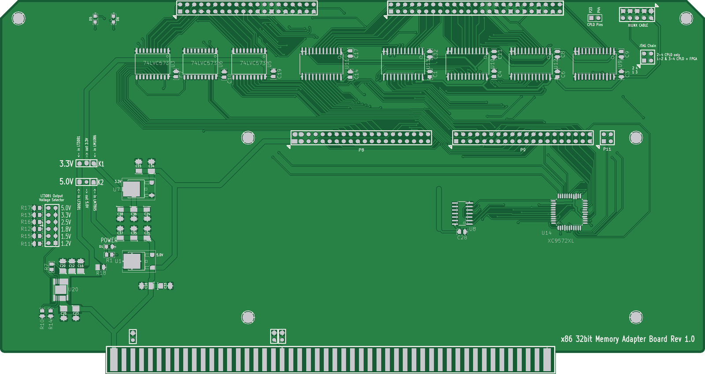
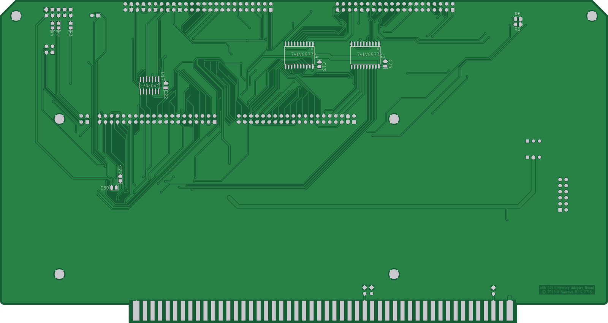
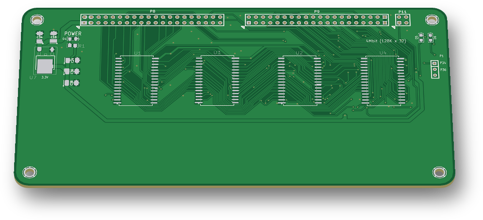

# x86 32bit Memory Adapter + 4Mbit SRAM module

Two boards from 2015–2016:
- **"x86 32bit Memory Adapter Board"**: an S-100-size card that connects the 80386 CPU board to a 32-bit, 3.3 V memory mezzanine.
- **"4Mbit (128K x 32)"**: an SRAM module for that mezzanine slot.

 

## Status
- **Adapter:** not built. Gerbers were plotted on 2015-04-25 (`adapter/GERBERS/`). The layout was changed after that (CPLD moved to the bottom side, LM2596 added, board re-routed up to 2016-01). No gerbers exist for the final layout.
- **SRAM module:** built. Gerbers were plotted on 2015-05-02 (`sram-module/GERBERS/`).

## Hardware

### Adapter (`adapter/`)
| Ref | Part | Role |
|---|---|---|
| U14 | XC9572XL-VQ44 | Control CPLD |
| U2–U6 | 74LVC573 | Latch the 80386 address (mA2–19, cA20–31) and byte enables mBE0–3* on `DB_ADS` |
| U10–U13 | 74LVX3245 | 32-bit data buffers, D0–31 (5 V) ↔ bD0–31 (3.3 V) |
| U9 | 74LVX3245 | Drives `DB_PHANTOM*` and `DB_WAIT` back up to 5 V for the 80386 board |
| U17, U8 | 74F04, 74F14 | Clock, `S100_SEL*` and `DB_ADS` conditioning |
| U1 | LM7805 | 5 V |
| U7 | LM1086 | 3.3 V |
| U20 | LT3081 | Adjustable rail |
| U19 | LM2596 | Buck pre-regulator (added 2015-07) |
| P5, P6 | 2×20, 2×25 headers | Ribbon connections to the 80386 CPU board (address/byte enables and data/control) |
| P8, P9 | 2×20 headers | 32-bit memory mezzanine slot |
| P11 | 2×2 header | JTAG to the mezzanine |
| P20 | S-100 edge | Power only (+8 V on pins 1/51, GND on pins 50/100) |

- **Size:** 254.00 × 134.62 mm, 2 layers.
- **Jumpers and headers** (silkscreen names):
  - **LT3081 Output Voltage Selector** (P13): 5.0 / 3.3 / 2.5 / 1.8 / 1.5 / 1.2 V.
  - **3.3V** (K1): takes 3.3 V from the LM1086 or the LT3081.
  - **5.0V** (K2): takes 5 V from the LM7805 or the LT3081.
  - **JTAG Chain** (P12): "2-4 CPLD only, 1-2 & 3-4 CPLD + FPGA". The second setting adds the mezzanine's device to the chain.
  - **XILINX CABLE** (P7, 2×7).
  - **CPLD Pins** (P10: CPLD pins 23 and 44).
  - JP5–JP7: tie S-100 pins 20, 53 and 70 to GND.
- **LEDs:**
  - POWER (D1);
  - `BOARD_SELECT` (D2, CPLD pin 32);
  - D5 and D6 (CPLD pins 33 and 31).

### SRAM module (`sram-module/`)
| Ref | Part | Role |
|---|---|---|
| U1–U4 | 128K×8 SRAM, SOP32 | One byte lane each: D0–7, D8–15, D16–23, D24–31 |
| U14 | XC9536XL-VQ44 | Byte-lane chip enables and write enables |
| U7 | LM1086 | 3.3 V from +8 V (P8 pins 1–4) |
| P8, P9 | 2×20 headers | Mezzanine connection to the adapter |
| P11 | 2×2 header | JTAG (TDO/TMS/TDI/TCK) |
| K1 | 3-pin header | CPLD pins 1, 34 and 36 (silkscreen "P1 / P34 / P36") |

- **Capacity:** 128K × 32 = **512 KB (4 Mbit)**, using word address lines A2–A18.
- **Slot headroom:** the P8/P9 slot also carries A19–A22 (unused on this module), which is enough for up to 8 MB.
- **Size:** 150.37 × 75.18 mm, 2 layers, 4 mounting holes.
- **LEDs:** POWER (D1), and D5/D6 (CPLD pins 33 and 31).

**KiCad (both boards):** 2013-07-07 BZR 4022 stable. The schematics are `EESchema Schematic File Version 2` and the PCBs are `kicad_pcb` version 3.

## How it works
- **No S-100 bus signals are used.** The adapter takes only power and GND from the S-100 edge connector. The 80386 CPU board drives the memory directly over the P5/P6 ribbon connectors.
- **Address and byte enables:** the five 74LVC573s latch the 80386 address and byte enables on `DB_ADS`.
  - A2–A22 go to the mezzanine as bA2–bA22.
  - The upper address bits (cA23–cA31) and the byte enables BE0–3* go both to the adapter CPLD and, over P9, to the mezzanine CPLD.
- **Data:** four 74LVX3245s buffer the 32-bit data bus between the 5 V 80386 side and the 3.3 V mezzanine.
  - Adapter CPLD pin 36 drives T/R (direction) on U10–U13.
  - CPLD pin 39 is on the same net as OE* of U10–U13.
- **Wait and phantom:** the adapter CPLD returns `DB_WAIT` and `DB_PHANTOM*` to the 80386 board through U9.
- **On the module:** the byte enables BE0–3* arrive on XC9536XL pins 14, 16, 18 and 19. The CPLD's pins 41–44 go to the four SRAM chip enables and pins 37–40 to the four write enables, one pair per SRAM.
  - The shared output enable of all four SRAMs is on module CPLD pin 12. It is also wired to P9 pin 26 (adapter CPLD pin 29).
  - Six further P9 pins link the two CPLDs directly (pins 2, 3, 5–8 on both).
- **JTAG chain:** P11 continues the adapter's chain into the module CPLD.
- **No CPLD source:** there is no CPLD project (no UCF or JEDEC) for either board in the original files.

## Files
| Path | Contents |
|---|---|
| `adapter/s100_80386 SRAM V6.*` | Adapter KiCad project (`.sch`, `-cache.lib`, `.pro`, `.kicad_pcb`, `.net`, `.cmp`) |
| `adapter/GERBERS/` | Adapter gerbers and drill file, plotted 2015-04-25 from the April layout |
| `sram-module/4Mem board v1.*` | Module KiCad project |
| `sram-module/GERBERS/` | Module gerbers and drill file, plotted 2015-05-02 |

Notes on the files:
- The adapter project keeps the file name of the Monahan design it started from (see Credits).
- The module gerbers of 2015-05-02 still contain a trial DDR3 DIMM footprint. The final module `.kicad_pcb` (2015-07-12) does not.
- The module schematic has an unannotated `SRAM_512KB` symbol placed outside the sheet. It is not in the netlist.

## History
The git history replays the original dated backups of both boards, from 2015-04-24 to 2016-01-13.

## Things to check (TODO)
- **Adapter:** U10–U13 OE* (net `CPLD_P39`) is driven by U17 (74F04) from `S100_SEL*` through one inverter, and it is also wired to CPLD pin 39. Check the polarity, and check that CPLD pin 39 is used only as an input.
- **Adapter:** the U6 (74LVC573) inputs D2–D7 (pins 4–9) are unconnected. So are the unused A/B pins of U9 (74LVX3245, pins 5–10 and 14–19). Check whether they need to be tied off.
- **Adapter:** U15 is a placeholder part, "ZZZZ1", in the final netlist and PCB. Check what it is meant to be.
- **Module:** the schematic note says "XC9532XL VQ44", but U14 is an XC9536XL-VQ44.

## Credits
- **The adapter started from John Monahan's S100 80386 SRAM V6 board** (S100Computers.com), the 32/64 MB SRAM board for his 80386 CPU board. Full credit to him for that design.
  - Evidence: the adapter's schematic keeps 49 of his component timestamps and his project file name.
  - The **P5/P6 interface to the 80386 board** keeps his pinout exactly.
  - The S-100 edge connector, card outline and card-ejector holes also come from his files.
- **New work in this folder:**
  - the CPLD and its logic connections;
  - the 3.3 V latches and buffers;
  - the power section (LM1086, LT3081, LM2596);
  - the JTAG chain;
  - the single 32-bit P8/P9 mezzanine pinout (his design used four byte-wide mezzanines);
  - the whole SRAM module.

## License
Hardware: CERN-OHL-S-2.0 for the original work in this folder. See the repo NOTICE for third-party parts.
